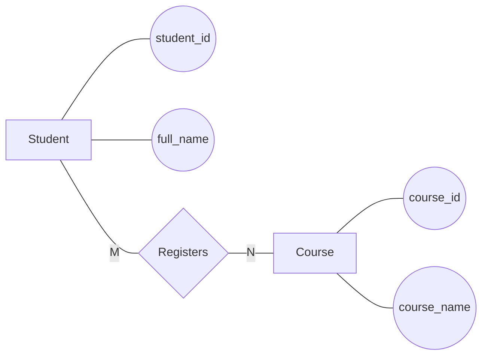

---

name: conceptual-design
description: Transform business requirement analysis into a conceptual ERD using Chen's notation represented with Mermaid Flowchart
compatibility: opencode
-----------------------

# Conceptual ERD Design Skill

## Objective

Use this skill to transform the business requirement analysis into a conceptual Entity Relationship Diagram (ERD).

The conceptual ERD must represent:

* Entities
* Attributes
* Relationships
* Cardinalities
* Participation constraints

The output will be used as input for logical database design.

---

## Required Input Files

Read:

* `docs/01-business-requirement-analysis.md`

If available, also read:

* `req/business-requirement.md`

Do not read unrelated files.

---

## Prerequisites

The following file must exist:

* `docs/01-business-requirement-analysis.md`

If the file is missing:

* Stop execution.
* Report the missing prerequisite artifact.

---

## Discovery Process

1. Read the business analysis document completely.
2. Identify all entities.
3. Identify all attributes.
4. Identify all relationships.
5. Identify cardinalities.
6. Identify participation constraints.
7. Resolve any inconsistencies before generating the ERD.

---

## Methodology

### 1. Create Entity Set Definitions

For each entity:

* Entity name
* Description
* Candidate identifier

### 2. Create Attribute Definitions

Identify:

* Key attributes
* Simple attributes
* Composite attributes
* Multivalued attributes
* Derived attributes

when applicable.

### 3. Create Relationship Definitions

For each relationship:

* Relationship name
* Participating entities
* Relationship meaning

### 4. Determine Cardinalities

Determine:

* 1:1
* 1:N
* M:N

for every relationship.

### 5. Determine Participation Constraints

Determine whether participation is:

* Total
* Partial

for each participating entity.

### 6. Validate Conceptual Consistency

Ensure:

* Every relationship connects valid entities.
* Every attribute belongs to an entity or relationship.
* Every entity participates in at least one relationship unless justified.

---

## Design Rules

### Conceptual Modeling Rules

The ERD must remain technology-independent.

Do not include:

* Foreign keys
* Tables
* SQL data types
* Physical implementation details
* Database constraints

### Entity Rules

Entities must represent:

* People
* Places
* Objects
* Events
* Concepts

with independent business meaning.

### Attribute Rules

Attributes must describe entities.

Do not model identifiers as foreign keys.

Primary identifiers may be marked for clarity.

### Relationship Rules

Relationships must:

* Have meaningful names
* Use verbs when possible
* Connect entities only

### Cardinality Rules

Every relationship must include cardinality information.

### Participation Rules

Indicate:

* Total participation
* Partial participation

when known from requirements.

---

## Output Specification

Create or update:

`docs/02-erd-design.md`

The document must contain:

### Conceptual ERD Description

* Entity definitions
* Attribute definitions
* Relationship definitions
* Cardinality analysis
* Participation analysis

### Conceptual ERD Diagram

Represent the ERD using:

```mermaid
flowchart LR
```

Do NOT use:

```mermaid
erDiagram
```

because Mermaid ERD notation corresponds to logical/crow's-foot modeling rather than conceptual Chen's notation.

Use Mermaid Flowchart to simulate Chen's notation:

* Rectangles for entities
* Ovals for attributes
* Diamonds for relationships
* Labeled edges for cardinalities
* Labeled edges for participation constraints when needed

Example:



---

## Validation Checklist

Before saving:

* Every entity from business analysis appears in the ERD.
* Every major attribute is represented.
* Every relationship is represented.
* Every relationship has cardinality.
* Participation constraints are included when known.
* No foreign keys are shown.
* No SQL concepts are shown.
* Mermaid syntax is valid.
* Mermaid Flowchart is used.
* Mermaid ERD is not used.

---

## Error Handling

If the business analysis document is missing:

* Stop execution.
* Report the missing file.

If conflicting entity or relationship definitions are found:

* Record the conflict.
* Select the most reasonable interpretation.
* Document the decision.

If cardinalities cannot be determined confidently:

* Make a justified assumption.
* Record the assumption in the output.
