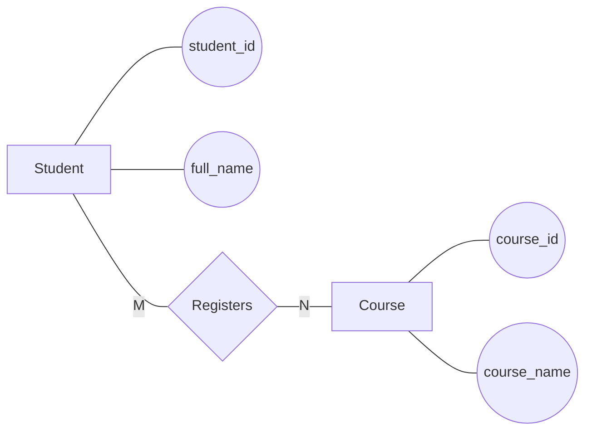

# Conceptual ERD Design Skill

## Objective

Use this skill to transform the business requirement analysis into a conceptual Entity Relationship Diagram (ERD).

The conceptual ERD must represent:

* Entities
* Attributes
* Relationships
* Cardinalities
* Participation constraints

The output will be used as input for logical database design.

---

## Required Input Files

Read the following files:

* `outputs/01-business-requirement-analysis-G7.md`

If an existing analysis already exists, also read:

* `outputs/02-erd-design-G7.md`

Do not read unrelated files unless explicitly requested.

---

## Prerequisites

The following file must exist:

* `outputs/01-business-requirement-analysis-G7.md`

If the file is missing:

* Stop execution.
* Report the missing prerequisite artifact.

---

## Discovery Process

1. Read the business analysis document completely.
2. Identify all entities.
3. Identify all attributes.
4. Identify all relationships.
5. Identify cardinalities.
6. Identify participation constraints.
7. Resolve any inconsistencies before generating the ERD.

---

## Execution process

### Step 1 — Load Business Analysis

Read:

`outputs/01-business-requirement-analysis-G7.md`

Extract the finalized business model, including:

* Accepted Entities
* Entity Attributes
* Relationships
* Cardinalities
* Participation Constraints
* Conflict Resolution Decisions

The Business Analysis is considered the authoritative source for conceptual modeling decisions.

Do not re-analyze the original requirements unless required information is missing.

---

### Step 2 — Validate Model Consistency

Review the extracted model and verify that:

* Every relationship references valid entities.
* Every attribute belongs to a valid entity.
* Cardinalities are defined for major relationships.
* Participation constraints are available when known.
* Modeling decisions are internally consistent.

If inconsistencies are detected:

* Record the issue.
* Apply the documented decision from the Business Analysis.
* Do not introduce new entities, attributes, or relationships unless no alternative exists.

---

### Step 3 — Prepare Conceptual ERD Components

Construct ERD components directly from the validated business model.

### Entities

Use only entities accepted in the Business Analysis.

Do not create additional entities.

---

### Attributes

Attach attributes to the entity defined in the Business Analysis.

Do not introduce implementation-specific attributes.

---

### Relationships

Use relationships exactly as defined in the Business Analysis.

Relationship names should preserve the business meaning identified during analysis.

---

### Cardinalities

Use cardinalities defined in the Business Analysis.

If a cardinality is missing:

* Derive the most reasonable interpretation from the available analysis.
* Document the assumption.

---

### Participation Constraints

Use participation constraints defined in the Business Analysis.

If participation cannot be determined confidently:

* Document the assumption.
* Record the justification.

---

### Step 4 — Generate Conceptual ERD Description

Create structured descriptions for:

### Entities

Describe the purpose of each entity.

### Attributes

List major attributes associated with each entity.

### Relationships

Describe the business meaning of each relationship.

### Cardinalities

Describe relationship multiplicities.

### Participation Constraints

Describe mandatory and optional participation where known.

---

### Step 5 — Generate Conceptual ERD Diagram

Transform the conceptual model into a Chen-style ERD using Mermaid Flowchart.

Represent:

```text
Entity → Rectangle

Attribute → Oval

Relationship → Diamond
```

Use:

```mermaid
flowchart LR
```

Do not use:

```mermaid
erDiagram
```

because Mermaid ERD notation represents logical modeling rather than conceptual Chen notation.

Do not introduce new entities, attributes, or relationships during diagram generation.

---

### Step 6 — Validate ERD Completeness

Verify that:

* Every accepted entity appears in the diagram.
* Every major attribute appears in the diagram.
* Every relationship appears in the diagram.
* Every relationship includes cardinality information.
* Participation constraints are documented when available.
* No rejected candidate appears as an entity.
* No primary keys are shown.
* No foreign keys are shown.
* No relational schema concepts are included.
* Mermaid syntax is valid.
* Mermaid Flowchart notation is used.

Record any assumptions made during ERD generation.

---

## Important rules

### Scope Restrictions Rules

This stage is not responsible for:

* Relational schema design
* Primary key selection
* Foreign key identification
* SQL design
* Table normalization
* Constraint implementation

Those activities belong to later stages.

### Example Usage Rules

Examples used in this skill are illustrative only.

Do not reuse example entities, actors, activities, or business rules from the examples.

Always derive results exclusively from the provided business requirements.

### Conceptual ERD Diagram

Represent the ERD using:

```mermaid
flowchart LR
```

Do NOT use:

```mermaid
erDiagram
```

because Mermaid ERD notation corresponds to logical/crow's-foot modeling rather than conceptual Chen's notation.

Use Mermaid Flowchart to simulate Chen's notation:

* Rectangles for entities
* Ovals for attributes
* Diamonds for relationships
* Labeled edges for cardinalities
* Labeled edges for participation constraints when needed

Example:



---

## Output Specification

Create or update:

`outputs/02-erd-design-G7.md`

The document must follow the template:

`.opencode/skills/erd-design/erd-design-template.md`

Do not omit any required section.

---

## Validation Checklist

Before saving:

* Every entity from business analysis appears in the ERD.
* Every major attribute is represented.
* Every relationship is represented.
* Every relationship has cardinality.
* Participation constraints are included when known.
* No foreign keys are shown.
* No SQL concepts are shown.
* Mermaid syntax is valid.
* Mermaid Flowchart is used.
* Mermaid ERD is not used.

---

## Error Handling

If `outputs/01-business-requirement-analysis-G7.md` does not exist:

* Stop execution.
* Report the missing file.

If conflicting entity or relationship definitions are found:

* Record the conflict.
* Select the most reasonable interpretation.
* Document the decision.

If cardinalities cannot be determined confidently:

* Make a justified assumption.
* Record the assumption in the output.