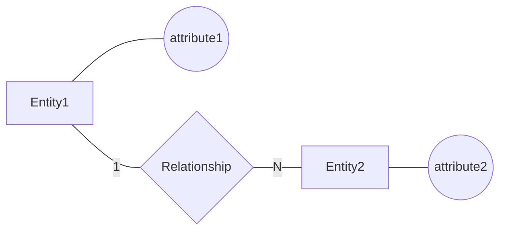

# Conceptual ERD Design

## 1. Design Overview

### Scope

[Describe the scope of the conceptual model.]

### Source Documents

* Business Requirement Analysis

---

## 2. Entity Definitions

### Entity: [Entity Name]

**Description**

[Entity description]

**Identifier**

[Candidate identifier]

---

Repeat for every entity.

---

## 3. Attribute Definitions

### Entity: [Entity Name]

| Attribute | Type | Notes |
| --------- | ---- | ----- |
|           |      |       |

Possible notes:

* Identifier
* Composite
* Multivalued
* Derived

---

Repeat for every entity.

---

## 4. Relationship Definitions

| Relationship | Entities | Description |
| ------------ | -------- | ----------- |
|              |          |             |

---

## 5. Cardinality Analysis

| Relationship | Cardinality |
| ------------ | ----------- |
|              |             |

Examples:

* User (1) — (N) Booking
* Booking (1) — (1) Approval
* Space (1) — (N) Maintenance

---

## 6. Participation Constraints

| Relationship | Entity | Participation   |
| ------------ | ------ | --------------- |
|              |        | Total / Partial |

---

## 7. Conceptual ERD Diagram

---

## 8. Design Decisions

| ID    | Decision | Justification |
| ----- | -------- | ------------- |
| DD-01 |          |               |

---

## 9. Assumptions and Ambiguities

| ID    | Description | Resolution |
| ----- | ----------- | ---------- |
| AM-01 |             |            |

---

## 10. Validation Summary

* [ ] All entities represented
* [ ] All relationships represented
* [ ] Cardinalities defined
* [ ] Participation constraints defined
* [ ] Mermaid Flowchart used
* [ ] Chen notation represented
* [ ] No foreign keys shown
* [ ] No SQL implementation details shown
