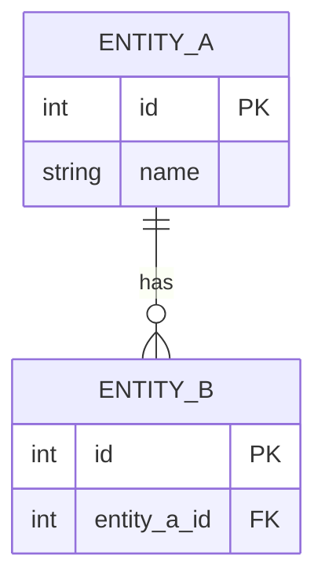

# Logical Database Design

## 1. Design Overview

### Source Documents

* Business Requirement Analysis
* Conceptual ERD Design

### Objective

Transform the conceptual ERD into a relational schema.

---

## 2. Relation Definitions

### Relation: [Relation Name]

**Description**

[Description]

**Attributes**

| Attribute | Notes |
| --------- | ----- |
|           |       |

**Primary Key**

| Attribute |
| --------- |
|           |

**Candidate Keys**

| Attribute(s) |
| ------------ |
|              |

**Foreign Keys**

| Attribute | References |
| --------- | ---------- |
|           |            |

---

Repeat for every relation.

---

## 3. Relationship Mapping

| Conceptual Relationship | Mapping Strategy         | Result |
| ----------------------- | ------------------------ | ------ |
|                         | 1:1 FK Mapping           |        |
|                         | 1:N FK Mapping           |        |
|                         | M:N Associative Relation |        |

---

## 4. Relational Schema

```text
Relation1(
    PK attribute1,
    attribute2,
    attribute3
)

Relation2(
    PK attribute1,
    FK attribute2 -> Relation1.attribute1,
    attribute3
)
```

---

## 5. Crow's Foot Logical Diagram

Represent the logical schema using Mermaid ERD notation.



---

## 6. Integrity Constraints

### Entity Integrity

| Relation | Constraint |
| -------- | ---------- |
|          |            |

### Referential Integrity

| Foreign Key | Referenced Relation |
| ----------- | ------------------- |
|             |                     |

### Key Constraints

| Relation | Constraint |
| -------- | ---------- |
|          |            |

---

## 7. Design Decisions

| ID    | Decision | Justification |
| ----- | -------- | ------------- |
| DD-01 |          |               |

---

## 8. Assumptions and Ambiguities

| ID    | Issue | Resolution |
| ----- | ----- | ---------- |
| AM-01 |       |            |

---

## 9. Validation Summary

* [ ] Every entity mapped to a relation
* [ ] Every relation has a primary key
* [ ] Foreign keys identified
* [ ] M:N relationships resolved
* [ ] Candidate keys documented
* [ ] Referential integrity represented
* [ ] Crow's Foot diagram generated
* [ ] Logical schema complete
