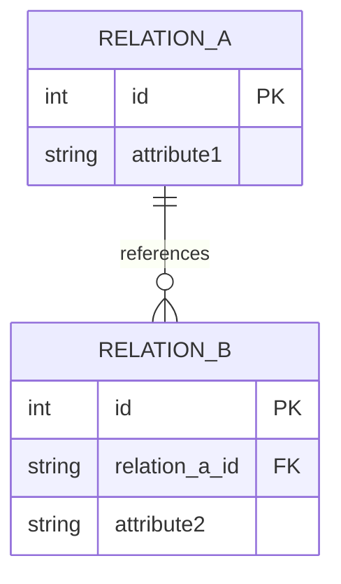

# Logical Database Design

# 1. Mapping Inventory

## Entities

| Entity | Type | Identifier |
|----------|----------|----------|
| | | |

---

## Relationships

| Relationship | Cardinality | Attributes |
|-------------|-------------|-------------|
| | | |

---

## Special Constructs

### Weak Entities

| Weak Entity | Owner | Partial Key |
|------------|------------|------------|
| | | |

### Multivalued Attributes

| Owner | Attribute |
|---------|---------|
| | |

### Composite Attributes

| Owner | Attribute |
|---------|---------|
| | |

### Recursive Relationships

| Relationship | Entity |
|-------------|---------|
| | |

### Specialization Structures

| Supertype | Subtype |
|-----------|-----------|
| | |

---

# 2. Entity Mapping

## Strong Entities

| Entity | Relation | PK | Candidate Keys |
|----------|----------|----------|----------|
| | | | |

### Decisions

Describe important mapping decisions.

---

## Weak Entities

| Weak Entity | Relation | PK | FK |
|------------|------------|------------|------------|
| | | | |

### Decisions

Describe identifying relationship mappings.

---

# 3. Relationship Mapping

## Binary 1:1 Relationships

| Relationship | Strategy | Result |
|-------------|-------------|-------------|
| | | |

### Rationale

---

## Binary 1:N Relationships

| Relationship | FK Placement |
|-------------|-------------|
| | |

### Rationale

---

## Binary M:N Relationships

| Relationship | Associative Relation |
|-------------|-------------|
| | |

### Rationale

---

## N-ary Relationships

| Relationship | Created Relation |
|-------------|-------------|
| | |

### Rationale

---

## Recursive Relationships

| Relationship | Mapping Strategy |
|-------------|-------------|
| | |

### Rationale

---

# 4. Special Construct Resolution

## Composite Attributes

| Attribute | Resolution |
|-----------|-----------|
| | |

---

## Multivalued Attributes

| Attribute | Relation Created |
|-----------|-----------|
| | |

---

## Derived Attributes

| Attribute | Stored | Rationale |
|-----------|-----------|-----------|
| | | |

---

## Generalization / Specialization

### Strategy

Describe selected inheritance mapping strategy.

### Rationale

---

# 5. Foreign Key Analysis

| Relation | Foreign Key | References |
|----------|------------|------------|
| | | |

### Referential Integrity Summary

---

# 6. Candidate Key Analysis

| Relation | Candidate Key | Justification |
|----------|----------|----------|
| | | |

---

# 7. Integrity Constraint Analysis

## Entity Integrity

Describe primary key constraints.

---

## Referential Integrity

Describe foreign key constraints.

---

## Business Key Constraints

Describe candidate key constraints.

---

# 8. Relational Schema Diagram

