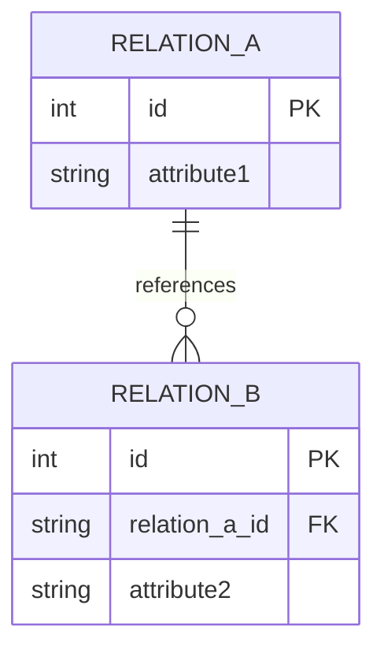

# Logical Database Design

# 1. Mapping Inventory

## Entities

| Entity | Type | Identifier |
|----------|----------|----------|
| | | |

---

## Relationships

| Relationship | Cardinality | Attributes |
|-------------|-------------|-------------|
| | | |

---

## Special Constructs

### Weak Entities

| Weak Entity | Owner | Partial Key |
|------------|------------|------------|
| | | |

### Multivalued Attributes

| Owner | Attribute |
|---------|---------|
| | |

### Composite Attributes

| Owner | Attribute |
|---------|---------|
| | |

### Recursive Relationships

| Relationship | Entity |
|-------------|---------|
| | |

### Specialization Structures

| Supertype | Subtype |
|-----------|-----------|
| | |

---

# 2. Entity Mapping

## Strong Entities

| Entity | Relation | PK | Candidate Keys |
|----------|----------|----------|----------|
| | | | |

### Decisions

Describe important mapping decisions.

---

## Weak Entities

| Weak Entity | Relation | PK | FK |
|------------|------------|------------|------------|
| | | | |

### Decisions

Describe identifying relationship mappings.

---

# 3. Attribute Catalog

| Relation | Attribute | Logical Domain | Nullable | Allowed Values / Range | Default | Notes |
|----------|-----------|----------------|----------|------------------------|---------|------|
| | | | | | | |

For every attribute in every relation, document:

- **Relation:** The relation that contains the attribute.
- **Attribute:** The attribute name.
- **Logical Domain:** The logical data type (e.g., Identifier, Integer, Decimal, String(100), Date, Timestamp, Boolean, Email, Phone, Enumeration).
- **Nullable:** Whether the attribute allows `NULL` values (`Yes` or `No`).
- **Allowed Values / Range:**
  - For **Enumeration**, list all valid values.
  - For **Numeric** attributes, specify the valid range (e.g., `>= 0`, `1..500`, `0-100`).
  - For **String** attributes, specify any required pattern or business rule if applicable.
- **Default:** The default value if explicitly specified in the business requirements; otherwise leave blank.
- **Notes:** Any additional assumptions or remarks relevant to the attribute.

---

# 4. Relationship Mapping

## Binary 1:1 Relationships

| Relationship | Strategy | Result |
|-------------|-------------|-------------|
| | | |

### Rationale

---

## Binary 1:N Relationships

| Relationship | FK Placement |
|-------------|-------------|
| | |

### Rationale

---

## Binary M:N Relationships

| Relationship | Associative Relation |
|-------------|-------------|
| | |

### Rationale

---

## N-ary Relationships

| Relationship | Created Relation |
|-------------|-------------|
| | |

### Rationale

---

## Recursive Relationships

| Relationship | Mapping Strategy |
|-------------|-------------|
| | |

### Rationale

---

# 5. Special Construct Resolution

## Composite Attributes

| Attribute | Resolution |
|-----------|-----------|
| | |

---

## Multivalued Attributes

| Attribute | Relation Created |
|-----------|-----------|
| | |

---

## Derived Attributes

| Attribute | Stored | Rationale |
|-----------|-----------|-----------|
| | | |

---

# 6. Foreign Key Analysis

| Relation | Foreign Key | References |
|----------|------------|------------|
| | | |

### Referential Integrity Summary

---

# 7. Candidate Key Analysis

| Relation | Candidate Key | Justification |
|----------|----------|----------|
| | | |

---

# 8. Integrity Constraint Analysis

## Entity Integrity

Describe primary key constraints.

---

## Referential Integrity

Describe foreign key constraints.

---

## Business Key Constraints

Describe candidate key constraints.

---

# 9. Relational Schema Diagram

```mermaid
erDiagram

    RELATION_A ||--o{ RELATION_B : references

    RELATION_A {
        int id PK
        string attribute1
    }

    RELATION_B {
        int id PK
        string relation_a_id FK
        string attribute2
    }
```