# Conceptual ERD Design

## 1. Design Overview

### Scope

This conceptual model covers the shared campus space management domain for the School of Computer Science. It includes entities for users, spaces, facilities, bookings, booking workflow records (approval, check-in, check-out), and maintenance. The model is technology-independent and uses Chen's notation.

### Source Documents

* Business Requirement Analysis (`docs/01-business-req-analysis.md`)

---

## 2. Entity Definitions

### Entity: User

**Description**

A person who interacts with the system — students, lecturers, teaching assistants, facility staff, department administrators, and facility managers.

**Identifier**

user_id (candidate key)

---

### Entity: Space

**Description**

A bookable physical location such as an auditorium, classroom, computer laboratory, project laboratory, meeting room, or student workspace.

**Identifier**

space_code (candidate key)

---

### Entity: Facility

**Description**

Equipment or amenity items available within a space, e.g., projector, whiteboard, microphone, computer, livestreaming equipment, air conditioner.

**Identifier**

facility_id (candidate key)

---

### Entity: Booking

**Description**

A request to reserve a space for a specific time period and purpose. The central transaction of the system.

**Identifier**

booking_id (candidate key)

---

### Entity: BookingApproval

**Description**

A weak entity representing the decision (approve or reject) on a booking request. Existence depends on the associated Booking.

**Identifier**

approval_id (partial key, combined with booking_id)

---

### Entity: BookingCheckIn

**Description**

A weak entity recording the arrival and space handover at the start of a booked session. Existence depends on the associated Booking.

**Identifier**

checkin_id (partial key, combined with booking_id)

---

### Entity: BookingCheckOut

**Description**

A weak entity recording the session completion and space handback at the end of a booked session. Existence depends on the associated Booking.

**Identifier**

checkout_id (partial key, combined with booking_id)

---

### Entity: Maintenance

**Description**

A problem report and resolution record for a space. Tracks issues, assignments, and completion.

**Identifier**

maintenance_id (candidate key)

---

## 3. Attribute Definitions

### Entity: User

| Attribute | Type | Notes |
| --------- | ---- | ----- |
| user_id | Simple | Identifier |
| full_name | Simple | |
| email | Simple | |
| phone | Simple | |
| role | Simple | |
| department | Simple | |
| account_status | Simple | |

### Entity: Space

| Attribute | Type | Notes |
| --------- | ---- | ----- |
| space_code | Simple | Identifier |
| space_name | Simple | |
| space_type | Simple | |
| building | Simple | |
| floor | Simple | |
| room_number | Simple | |
| capacity | Simple | |
| current_status | Simple | |
| usage_policy | Simple | |

### Entity: Facility

| Attribute | Type | Notes |
| --------- | ---- | ----- |
| facility_id | Simple | Identifier |
| facility_name | Simple | |
| description | Simple | |

### Entity: Booking

| Attribute | Type | Notes |
| --------- | ---- | ----- |
| booking_id | Simple | Identifier |
| requested_start | Simple | |
| requested_end | Simple | |
| purpose | Simple | |
| participant_count | Simple | |
| booking_type | Simple | |
| status | Simple | |
| created_at | Simple | |

### Entity: BookingApproval

| Attribute | Type | Notes |
| --------- | ---- | ----- |
| approval_id | Simple | Partial identifier |
| decision | Simple | |
| decision_time | Simple | |
| decision_note | Simple | |
| rejection_reason | Simple | |

### Entity: BookingCheckIn

| Attribute | Type | Notes |
| --------- | ---- | ----- |
| checkin_id | Simple | Partial identifier |
| actual_start_time | Simple | |
| initial_condition | Simple | |

### Entity: BookingCheckOut

| Attribute | Type | Notes |
| --------- | ---- | ----- |
| checkout_id | Simple | Partial identifier |
| actual_end_time | Simple | |
| final_condition | Simple | |
| usage_notes | Simple | |

### Entity: Maintenance

| Attribute | Type | Notes |
| --------- | ---- | ----- |
| maintenance_id | Simple | Identifier |
| problem_description | Simple | |
| start_time | Simple | |
| completion_time | Simple | |
| status | Simple | |
| result_note | Simple | |

---

## 4. Relationship Definitions

| Relationship | Entities | Description |
| ------------ | -------- | ----------- |
| Makes | User, Booking | A user submits a booking request |
| Books | Space, Booking | A booking is associated with a specific space |
| Contains | Space, Facility | A space contains facilities; a facility may be installed in many spaces |
| HasApproval | Booking, BookingApproval | The identifying relationship linking a booking to its approval decision |
| ApprovedBy | User, BookingApproval | A staff member approves or rejects a booking |
| HasCheckIn | Booking, BookingCheckIn | The identifying relationship linking a booking to its check-in record |
| CheckedInBy | User, BookingCheckIn | A staff member checks in a booking upon arrival |
| HasCheckOut | Booking, BookingCheckOut | The identifying relationship linking a booking to its checkout record |
| CheckedOutBy | User, BookingCheckOut | A staff member completes a booking after the session |
| Reports | User, Maintenance | A user reports a maintenance issue |
| AssignedTo | User, Maintenance | A staff member is assigned to resolve a maintenance issue |
| Undergoes | Space, Maintenance | A space may have maintenance records |

---

## 5. Cardinality Analysis

| Relationship | Cardinality |
| ------------ | ----------- |
| Makes | User (1) — (N) Booking |
| Books | Space (1) — (N) Booking |
| Contains | Space (M) — (N) Facility |
| HasApproval | Booking (1) — (1) BookingApproval |
| ApprovedBy | User (1) — (N) BookingApproval |
| HasCheckIn | Booking (1) — (1) BookingCheckIn |
| CheckedInBy | User (1) — (N) BookingCheckIn |
| HasCheckOut | Booking (1) — (1) BookingCheckOut |
| CheckedOutBy | User (1) — (N) BookingCheckOut |
| Reports | User (1) — (N) Maintenance |
| AssignedTo | User (1) — (N) Maintenance |
| Undergoes | Space (1) — (N) Maintenance |

---

## 6. Participation Constraints

| Relationship | Entity | Participation |
| ------------ | ------ | ------------- |
| Makes | User | Partial |
| Makes | Booking | Total |
| Books | Space | Partial |
| Books | Booking | Total |
| Contains | Space | Partial |
| Contains | Facility | Partial |
| HasApproval | Booking | Partial (only if booking is processed) |
| HasApproval | BookingApproval | Total |
| ApprovedBy | User | Partial |
| ApprovedBy | BookingApproval | Total |
| HasCheckIn | Booking | Partial (only if user arrives) |
| HasCheckIn | BookingCheckIn | Total |
| CheckedInBy | User | Partial |
| CheckedInBy | BookingCheckIn | Total |
| HasCheckOut | Booking | Partial (only if session completes) |
| HasCheckOut | BookingCheckOut | Total |
| CheckedOutBy | User | Partial |
| CheckedOutBy | BookingCheckOut | Total |
| Reports | User | Partial |
| Reports | Maintenance | Total |
| AssignedTo | User | Partial |
| AssignedTo | Maintenance | Partial |
| Undergoes | Space | Partial |
| Undergoes | Maintenance | Total |

---

## 7. Conceptual ERD Diagram

```mermaid
flowchart LR

%% ===== ENTITIES =====

User[User]
Space[Space]
Facility[Facility]
Booking[Booking]
Approval[BookingApproval]
CheckIn[BookingCheckIn]
CheckOut[BookingCheckOut]
Maintenance[Maintenance]

%% ===== ATTRIBUTES =====

uid((user_id))
uname((full_name))
uemail((email))
urole((role))
ustatus((account_status))

scode((space_code))
sname((space_name))
stype((space_type))
scap((capacity))
sstatus((current_status))

fid((facility_id))
fname((facility_name))

bid((booking_id))
bstart((requested_start))
bend((requested_end))
bpurpose((purpose))
btype((booking_type))
bstatus((status))

apid((approval_id))
adecision((decision))
atime((decision_time))

checkinid((checkin_id))
actstart((actual_start_time))

checkoutid((checkout_id))
actend((actual_end_time))

mid((maintenance_id))
mdesc((problem_description))
mstatus((status))

%% ===== RELATIONSHIPS =====

Makes{Makes}
Books{Books}
Contains{Contains}
HasApproval{HasApproval}
ApprovedBy{ApprovedBy}
HasCheckIn{HasCheckIn}
CheckedInBy{CheckedInBy}
HasCheckOut{HasCheckOut}
CheckedOutBy{CheckedOutBy}
Reports{Reports}
AssignedTo{AssignedTo}
Undergoes{Undergoes}

%% ===== USER ATTRIBUTES =====

User --- uid
User --- uname
User --- uemail
User --- urole
User --- ustatus

%% ===== SPACE ATTRIBUTES =====

Space --- scode
Space --- sname
Space --- stype
Space --- scap
Space --- sstatus

%% ===== FACILITY ATTRIBUTES =====

Facility --- fid
Facility --- fname

%% ===== BOOKING ATTRIBUTES =====

Booking --- bid
Booking --- bstart
Booking --- bend
Booking --- bpurpose
Booking --- btype
Booking --- bstatus

%% ===== APPROVAL ATTRIBUTES =====

Approval --- apid
Approval --- adecision
Approval --- atime

%% ===== CHECKIN ATTRIBUTES =====

CheckIn --- checkinid
CheckIn --- actstart

%% ===== CHECKOUT ATTRIBUTES =====

CheckOut --- checkoutid
CheckOut --- actend

%% ===== MAINTENANCE ATTRIBUTES =====

Maintenance --- mid
Maintenance --- mdesc
Maintenance --- mstatus

%% ===== RELATIONSHIP EDGES =====

User -- "1" --- Makes
Makes -- "N" --- Booking

Space -- "1" --- Books
Books -- "N" --- Booking

Space -- "M" --- Contains
Contains -- "N" --- Facility

Booking -- "1" --- HasApproval
HasApproval -- "1" --- Approval

User -- "1" --- ApprovedBy
ApprovedBy -- "N" --- Approval

Booking -- "1" --- HasCheckIn
HasCheckIn -- "1" --- CheckIn

User -- "1" --- CheckedInBy
CheckedInBy -- "N" --- CheckIn

Booking -- "1" --- HasCheckOut
HasCheckOut -- "1" --- CheckOut

User -- "1" --- CheckedOutBy
CheckedOutBy -- "N" --- CheckOut

User -- "1" --- Reports
Reports -- "N" --- Maintenance

User -- "1" --- AssignedTo
AssignedTo -- "N" --- Maintenance

Space -- "1" --- Undergoes
Undergoes -- "N" --- Maintenance
```

---

## 8. Design Decisions

| ID | Decision | Justification |
| -- | -------- | ------------- |
| DD-01 | BookingApproval, BookingCheckIn, and BookingCheckOut modeled as weak entities dependent on Booking | These records have no independent existence; they exist only in the context of a booking. BookingApproval shares booking_id as part of its identifier. |
| DD-02 | Contains (Space–Facility) represented as an M:N relationship without a separate intersecting entity | At the conceptual level, the many-to-many relationship is a first-class relationship. The intersecting entity SpaceFacility will be introduced during logical design. |
| DD-03 | User-involved relationships (ApprovedBy, CheckedInBy, CheckedOutBy) kept separate from the booking-to-weak-entity identifying relationships | Distinguishes the identifying relationship (Booking → weak entity) from the external relationship (User → weak entity), preserving clarity. |
| DD-04 | Only key attributes shown in the diagram; all attributes listed in the tables | Mermaid flowchart readability degrades with too many nodes. Full attribute inventory is preserved in Section 3. |

---

## 9. Assumptions and Ambiguities

| ID | Description | Resolution |
| -- | ----------- | ---------- |
| AM-01 | Whether HasApproval, HasCheckIn, HasCheckOut participation on Booking is total or partial | Assumed partial — not every booking will necessarily have an approval, check-in, or check-out record (e.g., pending bookings have no approval; no-show bookings have no check-in). |
| AM-02 | Whether a single Booking could have multiple approval records (multi-step approval) | Assumed single approval only, matching the 1:1 cardinality from business rules. |
| AM-03 | Whether AssignedTo participation on Maintenance is total or partial | Assumed partial — a maintenance record may be reported but not yet assigned to a specific staff member. |

---

## 10. Validation Summary

* [x] All entities represented
* [x] All relationships represented
* [x] Cardinalities defined
* [x] Participation constraints defined
* [x] Mermaid Flowchart used
* [x] Chen notation represented
* [x] No foreign keys shown
* [x] No SQL implementation details shown
