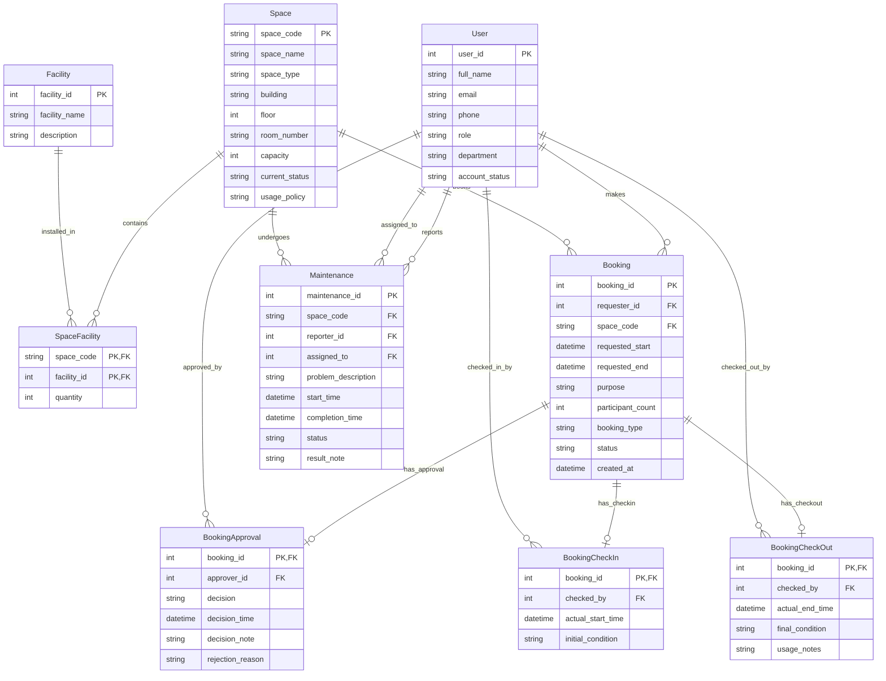

# Logical Database Design

## 1. Design Overview

### Source Documents

* Business Requirement Analysis (`docs/01-business-req-analysis.md`)
* Conceptual ERD Design (`docs/02-erd-design.md`)

### Objective

Transform the conceptual ERD (Chen's notation) into a DBMS-independent relational schema suitable for implementation.

---

## 2. Relation Definitions

### Relation: User

**Description**

Stores information about all system users — students, lecturers, TAs, staff, administrators, and managers.

**Attributes**

| Attribute | Notes |
| --------- | ----- |
| user_id | System-generated unique identifier |
| full_name | |
| email | |
| phone | Optional |
| role | Enum: student, lecturer, ta, facility_staff, admin, manager |
| department | |
| account_status | Enum: active, suspended, disabled |

**Primary Key**

| Attribute |
| --------- |
| user_id |

**Candidate Keys**

| Attribute(s) |
| ------------ |
| email |

**Foreign Keys**

None.

---

### Relation: Space

**Description**

Stores information about bookable physical locations.

**Attributes**

| Attribute | Notes |
| --------- | ----- |
| space_code | Unique alphanumeric code |
| space_name | |
| space_type | Enum: auditorium, classroom, computer_lab, project_lab, meeting_room, workspace |
| building | |
| floor | |
| room_number | |
| capacity | Positive integer |
| current_status | Enum: available, in_use, under_maintenance, temporarily_closed, retired |
| usage_policy | Free text |

**Primary Key**

| Attribute |
| --------- |
| space_code |

**Candidate Keys**

| Attribute(s) |
| ------------ |
| (building, floor, room_number) |

**Foreign Keys**

None.

---

### Relation: Facility

**Description**

Master list of equipment items or amenities that can be installed in spaces.

**Attributes**

| Attribute | Notes |
| --------- | ----- |
| facility_id | System-generated unique identifier |
| facility_name | |
| description | Optional |

**Primary Key**

| Attribute |
| --------- |
| facility_id |

**Candidate Keys**

| Attribute(s) |
| ------------ |
| facility_name |

**Foreign Keys**

None.

---

### Relation: SpaceFacility

**Description**

Associative relation resolving the M:N relationship between Space and Facility. Records which facilities are installed in which spaces and their quantity.

**Attributes**

| Attribute | Notes |
| --------- | ----- |
| space_code | |
| facility_id | |
| quantity | Default 1 |

**Primary Key**

| Attribute |
| --------- |
| space_code, facility_id |

**Candidate Keys**

None.

**Foreign Keys**

| Attribute | References |
| --------- | ---------- |
| space_code | Space(space_code) |
| facility_id | Facility(facility_id) |

---

### Relation: Booking

**Description**

Stores booking requests made by users for specific spaces and time periods.

**Attributes**

| Attribute | Notes |
| --------- | ----- |
| booking_id | System-generated unique identifier |
| requester_id | |
| space_code | |
| requested_start | |
| requested_end | Must be after requested_start |
| purpose | Free text |
| participant_count | |
| booking_type | Enum: lecture, examination, seminar, workshop, meeting, student_activity, admin_event |
| status | Enum: pending, approved, rejected, cancelled, checked_in, completed, no_show |
| created_at | Auto-generated timestamp |

**Primary Key**

| Attribute |
| --------- |
| booking_id |

**Candidate Keys**

None.

**Foreign Keys**

| Attribute | References |
| --------- | ---------- |
| requester_id | User(user_id) |
| space_code | Space(space_code) |

---

### Relation: BookingApproval

**Description**

Weak entity recording the approval or rejection decision for a booking. 1:1 identifying relationship with Booking — booking_id serves as primary key.

**Attributes**

| Attribute | Notes |
| --------- | ----- |
| booking_id | Inherited from Booking; also serves as PK due to 1:1 relationship |
| approver_id | |
| decision | Enum: approved, rejected |
| decision_time | |
| decision_note | Optional |
| rejection_reason | Required when decision = rejected |

**Primary Key**

| Attribute |
| --------- |
| booking_id |

**Candidate Keys**

None.

**Foreign Keys**

| Attribute | References |
| --------- | ---------- |
| booking_id | Booking(booking_id) |
| approver_id | User(user_id) |

---

### Relation: BookingCheckIn

**Description**

Weak entity recording the check-in event when a requester arrives for a booked session. 1:1 identifying relationship with Booking — booking_id serves as primary key.

**Attributes**

| Attribute | Notes |
| --------- | ----- |
| booking_id | Inherited from Booking; also serves as PK due to 1:1 relationship |
| checked_by | |
| actual_start_time | |
| initial_condition | Free text |

**Primary Key**

| Attribute |
| --------- |
| booking_id |

**Candidate Keys**

None.

**Foreign Keys**

| Attribute | References |
| --------- | ---------- |
| booking_id | Booking(booking_id) |
| checked_by | User(user_id) |

---

### Relation: BookingCheckOut

**Description**

Weak entity recording the check-out event when a session ends. 1:1 identifying relationship with Booking — booking_id serves as primary key.

**Attributes**

| Attribute | Notes |
| --------- | ----- |
| booking_id | Inherited from Booking; also serves as PK due to 1:1 relationship |
| checked_by | |
| actual_end_time | |
| final_condition | Free text |
| usage_notes | Free text |

**Primary Key**

| Attribute |
| --------- |
| booking_id |

**Candidate Keys**

None.

**Foreign Keys**

| Attribute | References |
| --------- | ---------- |
| booking_id | Booking(booking_id) |
| checked_by | User(user_id) |

---

### Relation: Maintenance

**Description**

Stores problem reports and resolution records for spaces.

**Attributes**

| Attribute | Notes |
| --------- | ----- |
| maintenance_id | System-generated unique identifier |
| space_code | |
| reporter_id | |
| assigned_to | Nullable; assigned only after review |
| problem_description | |
| start_time | When the problem was reported |
| completion_time | Nullable |
| status | Enum: reported, assigned, in_progress, completed, cancelled |
| result_note | Nullable |

**Primary Key**

| Attribute |
| --------- |
| maintenance_id |

**Candidate Keys**

None.

**Foreign Keys**

| Attribute | References |
| --------- | ---------- |
| space_code | Space(space_code) |
| reporter_id | User(user_id) |
| assigned_to | User(user_id) |

---

## 3. Relationship Mapping

| Conceptual Relationship | Mapping Strategy | Result |
| ----------------------- | ---------------- | ------ |
| Makes (User 1:N Booking) | 1:N FK on N-side | FK requester_id in Booking references User |
| Books (Space 1:N Booking) | 1:N FK on N-side | FK space_code in Booking references Space |
| Contains (Space M:N Facility) | M:N Associative Relation | SpaceFacility(space_code, facility_id) |
| HasApproval (Booking 1:1 BookingApproval) | 1:1 FK — merge PK into weak entity | booking_id in BookingApproval references Booking |
| ApprovedBy (User 1:N BookingApproval) | 1:N FK on N-side | FK approver_id in BookingApproval references User |
| HasCheckIn (Booking 1:1 BookingCheckIn) | 1:1 FK — merge PK into weak entity | booking_id in BookingCheckIn references Booking |
| CheckedInBy (User 1:N BookingCheckIn) | 1:N FK on N-side | FK checked_by in BookingCheckIn references User |
| HasCheckOut (Booking 1:1 BookingCheckOut) | 1:1 FK — merge PK into weak entity | booking_id in BookingCheckOut references Booking |
| CheckedOutBy (User 1:N BookingCheckOut) | 1:N FK on N-side | FK checked_by in BookingCheckOut references User |
| Reports (User 1:N Maintenance) | 1:N FK on N-side | FK reporter_id in Maintenance references User |
| AssignedTo (User 1:N Maintenance) | 1:N FK on N-side | FK assigned_to in Maintenance references User |
| Undergoes (Space 1:N Maintenance) | 1:N FK on N-side | FK space_code in Maintenance references Space |

---

## 4. Relational Schema

```text
User(
    PK user_id,
    full_name,
    email,
    phone,
    role,
    department,
    account_status
)

Space(
    PK space_code,
    space_name,
    space_type,
    building,
    floor,
    room_number,
    capacity,
    current_status,
    usage_policy
)

Facility(
    PK facility_id,
    facility_name,
    description
)

SpaceFacility(
    PK space_code,
    PK facility_id,
    quantity,
    FK space_code -> Space(space_code),
    FK facility_id -> Facility(facility_id)
)

Booking(
    PK booking_id,
    FK requester_id -> User(user_id),
    FK space_code -> Space(space_code),
    requested_start,
    requested_end,
    purpose,
    participant_count,
    booking_type,
    status,
    created_at
)

BookingApproval(
    PK booking_id,
    FK booking_id -> Booking(booking_id),
    FK approver_id -> User(user_id),
    decision,
    decision_time,
    decision_note,
    rejection_reason
)

BookingCheckIn(
    PK booking_id,
    FK booking_id -> Booking(booking_id),
    FK checked_by -> User(user_id),
    actual_start_time,
    initial_condition
)

BookingCheckOut(
    PK booking_id,
    FK booking_id -> Booking(booking_id),
    FK checked_by -> User(user_id),
    actual_end_time,
    final_condition,
    usage_notes
)

Maintenance(
    PK maintenance_id,
    FK space_code -> Space(space_code),
    FK reporter_id -> User(user_id),
    FK assigned_to -> User(user_id),
    problem_description,
    start_time,
    completion_time,
    status,
    result_note
)
```

---

## 5. Crow's Foot Logical Diagram



---

## 6. Integrity Constraints

### Entity Integrity

| Relation | Constraint |
| -------- | ---------- |
| User | PRIMARY KEY (user_id) |
| Space | PRIMARY KEY (space_code) |
| Facility | PRIMARY KEY (facility_id) |
| SpaceFacility | PRIMARY KEY (space_code, facility_id) |
| Booking | PRIMARY KEY (booking_id) |
| BookingApproval | PRIMARY KEY (booking_id) |
| BookingCheckIn | PRIMARY KEY (booking_id) |
| BookingCheckOut | PRIMARY KEY (booking_id) |
| Maintenance | PRIMARY KEY (maintenance_id) |

### Referential Integrity

| Foreign Key | Referenced Relation |
| ----------- | ------------------- |
| Booking.requester_id | User(user_id) |
| Booking.space_code | Space(space_code) |
| SpaceFacility.space_code | Space(space_code) |
| SpaceFacility.facility_id | Facility(facility_id) |
| BookingApproval.booking_id | Booking(booking_id) |
| BookingApproval.approver_id | User(user_id) |
| BookingCheckIn.booking_id | Booking(booking_id) |
| BookingCheckIn.checked_by | User(user_id) |
| BookingCheckOut.booking_id | Booking(booking_id) |
| BookingCheckOut.checked_by | User(user_id) |
| Maintenance.space_code | Space(space_code) |
| Maintenance.reporter_id | User(user_id) |
| Maintenance.assigned_to | User(user_id) |

### Key Constraints

| Relation | Constraint |
| -------- | ---------- |
| User | UNIQUE (email) |
| Space | UNIQUE (building, floor, room_number) |
| Facility | UNIQUE (facility_name) |
| BookingApproval | UNIQUE (booking_id) — enforced by PK |
| BookingCheckIn | UNIQUE (booking_id) — enforced by PK |
| BookingCheckOut | UNIQUE (booking_id) — enforced by PK |

---

## 7. Design Decisions

| ID | Decision | Justification |
| -- | -------- | ------------- |
| DD-01 | Weak entities (BookingApproval, BookingCheckIn, BookingCheckOut) use booking_id as PK instead of composite (partial_key, booking_id) | The 1:1 identifying relationship guarantees booking_id is already unique per instance; a composite key would add complexity without benefit. The partial key (approval_id, checkin_id, checkout_id) is omitted since it becomes redundant. |
| DD-02 | SpaceFacility created as an associative relation for the M:N Contains relationship | Standard mapping for many-to-many relationships. Supports the additional quantity attribute. |
| DD-03 | Maintenance.assigned_to is nullable | A maintenance record may exist without an assigned staff member at the time of reporting. |
| DD-04 | Maintenance.completion_time, result_note nullable | Completed status and notes are unavailable until the maintenance is resolved. |

---

## 8. Assumptions and Ambiguities

| ID | Issue | Resolution |
| -- | ----- | ---------- |
| AM-01 | Whether a weak entity's partial key should be preserved | Partial keys omitted because 1:1 identifying relationship makes the owner PK sufficient for unique identification. |
| AM-02 | Whether BookingCheckIn and BookingCheckOut could share checked_by with different semantics | Kept as separate FK columns referencing User; the same staff member performs both actions in this design. |
| AM-03 | Whether pending bookings should store a negative approval indicator | No record in BookingApproval means the booking is pending. No null columns needed. |

---

## 9. Validation Summary

* [x] Every entity mapped to a relation
* [x] Every relation has a primary key
* [x] Foreign keys identified
* [x] M:N relationships resolved
* [x] Candidate keys documented
* [x] Referential integrity represented
* [x] Crow's Foot diagram generated
* [x] Logical schema complete
