# Conceptual ERD Design

## 1. Entity Definitions

| Entity | Classification | Description |
| ------ | -------------- | ----------- |
| User | Strong | A person who interacts with the system with a university account and acts in one of six roles |
| Space | Strong | A bookable physical location on campus managed by the School of Computer Science |
| Facility | Strong | Equipment or amenities available in a space (e.g., projector, whiteboard, microphone) |
| Booking | Strong | A request submitted by a user to reserve a space for a specific time period and purpose |
| Approval | Strong | A decision made by facility staff or manager to approve or reject a booking request |
| Session | Strong | The actual usage of a space corresponding to an approved booking, capturing real vs. planned activity |
| Maintenance Record | Strong | A record of a maintenance issue reported for a space, tracking the problem through resolution |

### Entity Classification Justification

| Entity | Classification | Justification |
| ------ | -------------- | ------------- |
| User | Strong | Has its own unique identifier (`user_id`). Existence does not depend on any other entity. Can exist independently in the system. |
| Space | Strong | Has its own unique identifier (`space_code`). Existence does not depend on any other entity. |
| Facility | Strong | Has its own unique identifier (`facility_id`). Existence does not depend on any other entity. |
| Booking | Strong | Has its own unique identifier (`booking_id`). Existence does not depend on any other entity. |
| Approval | Strong | Has its own unique identifier (`approval_id`). Existence does not depend on any other entity. |
| Session | Strong | Has its own unique identifier (`session_id`). Existence does not depend on any other entity. |
| Maintenance Record | Strong | Has its own unique identifier (`maintenance_id`). Existence does not depend on any other entity. |

---

## 2. Attributes

### Entity: User

| Attribute | Classification | Justification |
| --------- | -------------- | ------------- |
| user_id | Key Attribute | Uniquely identifies each user occurrence |
| full_name | Composite Attribute | Can be meaningfully decomposed into first name and last name |
| email | Simple Attribute | Atomic value; cannot be meaningfully decomposed |
| phone_number | Simple Attribute | Atomic value; treated as single-valued per business analysis |
| role | Simple Attribute | Atomic enumeration value |
| department | Simple Attribute | Atomic value representing organizational unit |
| account_status | Simple Attribute | Atomic enumeration value (active, suspended) |

### Entity: Space

| Attribute | Classification | Justification |
| --------- | -------------- | ------------- |
| space_code | Key Attribute | Uniquely identifies each space occurrence |
| space_name | Simple Attribute | Atomic value; human-readable name |
| space_type | Simple Attribute | Atomic enumeration value (auditorium, classroom, etc.) |
| building | Simple Attribute | Atomic value representing building identifier |
| floor | Simple Attribute | Atomic numeric value |
| room_number | Simple Attribute | Atomic value representing room within building |
| capacity | Simple Attribute | Atomic numeric value |
| status | Simple Attribute | Atomic enumeration value (available, in_use, etc.) |
| usage_policy | Simple Attribute | Atomic text value |

### Entity: Facility

| Attribute | Classification | Justification |
| --------- | -------------- | ------------- |
| facility_id | Key Attribute | Uniquely identifies each facility type |
| facility_name | Simple Attribute | Atomic value; descriptive name of the facility |
| description | Simple Attribute | Atomic text value; optional details |

### Entity: Booking

| Attribute | Classification | Justification |
| --------- | -------------- | ------------- |
| booking_id | Key Attribute | Uniquely identifies each booking request |
| requested_start_time | Simple Attribute | Atomic datetime value |
| requested_end_time | Simple Attribute | Atomic datetime value |
| purpose | Simple Attribute | Atomic enumeration value (lecture, examination, etc.) |
| expected_participants | Simple Attribute | Atomic numeric value |
| status | Simple Attribute | Atomic enumeration value (pending, approved, etc.) |

### Entity: Approval

| Attribute | Classification | Justification |
| --------- | -------------- | ------------- |
| approval_id | Key Attribute | Uniquely identifies each approval decision |
| decision | Simple Attribute | Atomic enumeration value (approved, rejected) |
| decision_time | Simple Attribute | Atomic datetime value |
| decision_note | Simple Attribute | Atomic text value; notes accompanying decision |
| rejection_reason | Simple Attribute | Atomic text value; required if decision is rejected |

### Entity: Session

| Attribute | Classification | Justification |
| --------- | -------------- | ------------- |
| session_id | Key Attribute | Uniquely identifies each session |
| actual_start_time | Simple Attribute | Atomic datetime value |
| actual_end_time | Simple Attribute | Atomic datetime value |
| initial_condition | Simple Attribute | Atomic text value; condition at check-in |
| final_condition | Simple Attribute | Atomic text value; condition at completion |
| usage_notes | Simple Attribute | Atomic text value; notes about the usage session |

### Entity: Maintenance Record

| Attribute | Classification | Justification |
| --------- | -------------- | ------------- |
| maintenance_id | Key Attribute | Uniquely identifies each maintenance record |
| problem_description | Simple Attribute | Atomic text value; description of the issue |
| start_time | Simple Attribute | Atomic datetime value |
| completion_time | Simple Attribute | Atomic datetime value; null until completed |
| status | Simple Attribute | Atomic enumeration value (reported, in_progress, completed) |
| result_note | Simple Attribute | Atomic text value; outcome of maintenance work |

---

## 3. Relationships

| Relationship | Degree | Classification | Relationship Attributes | Participating Entities | Description |
| ------------ | ------ | -------------- | ---------------------- | ---------------------- | ----------- |
| submits | Binary | Non-identifying | - | User, Booking | A user (requester) creates a booking request to reserve a space |
| reserves | Binary | Non-identifying | - | Booking, Space | A booking request reserves a specific space for a defined time period |
| makes | Binary | Non-identifying | - | User, Approval | A facility staff member or manager makes an approval decision on a booking request |
| reviews | Binary | Non-identifying | - | Approval, Booking | An approval decision reviews and determines the outcome of a specific booking request |
| conducts | Binary | Non-identifying | - | User, Session | Facility staff conduct a usage session by performing check-in and completion operations |
| tracks | Binary | Non-identifying | - | Session, Booking | A session records the actual usage that corresponds to an approved booking |
| reports | Binary | Non-identifying | - | User, Maintenance Record | A user reports a maintenance issue, creating a maintenance record for a space |
| pertains_to | Binary | Non-identifying | - | Maintenance Record, Space | A maintenance record describes an issue with a specific space |
| equipped_with | Binary | Non-identifying | quantity | Space, Facility | A space is equipped with various facilities; a facility may be available in multiple spaces |
| assigned_to | Binary | Non-identifying | - | User, Maintenance Record | A facility staff member is assigned to handle a specific maintenance record |

### Relationship Classification Justification

All relationships are classified as **Non-identifying** because:

- Both participating entities in every relationship are strong entities with independent identity.
- No relationship contributes to the identity of any participating entity.
- No weak entities exist in the conceptual model.

---

## 4. Cardinality and Participation Summary

| Relationship | Source → Target | Cardinality | Source Participation | Target Participation | Business Rule Reference |
| ------------ | --------------- | ----------- | ------------------- | -------------------- | ----------------------- |
| submits | User → Booking | 1:N | Partial (not all users must submit bookings) | Total (every booking must be submitted by exactly one user) | BR-07 |
| reserves | Booking → Space | N:1 | Total (every booking must reserve exactly one space) | Partial (not all spaces must be reserved) | BR-08 |
| makes | User → Approval | 1:N | Partial (only facility staff/managers make approvals) | Total (every approval must be made by exactly one user) | BR-21 |
| reviews | Approval → Booking | 1:1 | Total (every approval must review exactly one booking) | Partial (a booking may have at most one approval) | BR-09, BR-11 |
| conducts | User → Session | 1:N | Partial (only facility staff conduct sessions) | Total (every session must be conducted by exactly one user) | BR-22 |
| tracks | Session → Booking | 1:1 | Total (every session must track exactly one booking) | Partial (a booking may have at most one session) | BR-10, BR-12 |
| reports | User → Maintenance Record | 1:N | Partial (not all users report maintenance) | Total (every maintenance record must be reported by exactly one user) | BR-15 |
| pertains_to | Maintenance Record → Space | N:1 | Total (every maintenance record must pertain to exactly one space) | Partial (a space may have multiple maintenance records) | BR-17 |
| equipped_with | Space → Facility | M:N | Partial (not all spaces must be equipped with facilities) | Partial (not all facilities must be available in spaces) | - |
| assigned_to | User → Maintenance Record | 1:N | Partial (only facility staff are assigned) | Total (every maintenance record must be assigned to exactly one staff member) | BR-16, BR-23 |

---

## 5. Conceptual ERD Diagram

```mermaid
flowchart LR

    %% =========================
    %% Style definitions
    %% =========================
    classDef key stroke-width:3px,stroke:#000,fill:#fff

    %% =========================
    %% User Entity & Attributes
    %% =========================
    User[User]
    UserID((user_id)):::key
    FullName((full_name))
    FirstName((first_name))
    LastName((last_name))
    Email((email))
    Phone((phone_number))
    Role((role))
    Dept((department))
    AcctStatus((account_status))

    User --- UserID
    User --- FullName
    User --- Email
    User --- Phone
    User --- Role
    User --- Dept
    User --- AcctStatus

    FullName --- FirstName
    FullName --- LastName

    %% =========================
    %% Space Entity & Attributes
    %% =========================
    Space[Space]
    SpaceCode((space_code)):::key
    SpaceName((space_name))
    SpaceType((space_type))
    Building((building))
    Floor((floor))
    RoomNum((room_number))
    Capacity((capacity))
    SpaceStatus((status))
    UsagePolicy((usage_policy))

    Space --- SpaceCode
    Space --- SpaceName
    Space --- SpaceType
    Space --- Building
    Space --- Floor
    Space --- RoomNum
    Space --- Capacity
    Space --- SpaceStatus
    Space --- UsagePolicy

    %% =========================
    %% Facility Entity & Attributes
    %% =========================
    Facility[Facility]
    FacilityID((facility_id)):::key
    FacilityName((facility_name))
    FacilityDesc((description))

    Facility --- FacilityID
    Facility --- FacilityName
    Facility --- FacilityDesc

    %% =========================
    %% Booking Entity & Attributes
    %% =========================
    Booking[Booking]
    BookingID((booking_id)):::key
    RequestedStart((requested_start_time))
    RequestedEnd((requested_end_time))
    Purpose((purpose))
    ExpectedPart((expected_participants))
    BookingStatus((status))

    Booking --- BookingID
    Booking --- RequestedStart
    Booking --- RequestedEnd
    Booking --- Purpose
    Booking --- ExpectedPart
    Booking --- BookingStatus

    %% =========================
    %% Approval Entity & Attributes
    %% =========================
    Approval[Approval]
    ApprovalID((approval_id)):::key
    Decision((decision))
    DecisionTime((decision_time))
    DecisionNote((decision_note))
    RejectReason((rejection_reason))

    Approval --- ApprovalID
    Approval --- Decision
    Approval --- DecisionTime
    Approval --- DecisionNote
    Approval --- RejectReason

    %% =========================
    %% Session Entity & Attributes
    %% =========================
    Session[Session]
    SessionID((session_id)):::key
    ActualStart((actual_start_time))
    ActualEnd((actual_end_time))
    InitCond((initial_condition))
    FinalCond((final_condition))
    UsageNotes((usage_notes))

    Session --- SessionID
    Session --- ActualStart
    Session --- ActualEnd
    Session --- InitCond
    Session --- FinalCond
    Session --- UsageNotes

    %% =========================
    %% Maintenance Record Entity & Attributes
    %% =========================
    MaintRec[Maintenance Record]
    MaintID((maintenance_id)):::key
    ProbDesc((problem_description))
    MaintStart((start_time))
    MaintComplete((completion_time))
    MaintStatus((status))
    ResultNote((result_note))

    MaintRec --- MaintID
    MaintRec --- ProbDesc
    MaintRec --- MaintStart
    MaintRec --- MaintComplete
    MaintRec --- MaintStatus
    MaintRec --- ResultNote

    %% =========================
    %% Relationships
    %% =========================
    Submits{Submits}
    Reserves{Reserves}
    Makes{Makes}
    Reviews{Reviews}
    Conducts{Conducts}
    Tracks{Tracks}
    Reports{Reports}
    PertainsTo{Pertains To}
    EquippedWith{Equipped With}
    AssignedTo{Assigned To}

    %% EquippedWith relationship attribute
    EqQty((quantity))
    EquippedWith --- EqQty

    %% =========================
    %% Relationship Links with Cardinalities
    %% =========================
    User -- "1" --- Submits
    Submits -- "N" --- Booking

    Booking -- "N" --- Reserves
    Reserves -- "1" --- Space

    User -- "1" --- Makes
    Makes -- "N" --- Approval

    Approval -- "1" --- Reviews
    Reviews -- "1" --- Booking

    User -- "1" --- Conducts
    Conducts -- "N" --- Session

    Session -- "1" --- Tracks
    Tracks -- "1" --- Booking

    User -- "1" --- Reports
    Reports -- "N" --- MaintRec

    MaintRec -- "N" --- PertainsTo
    PertainsTo -- "1" --- Space

    Space -- "M" --- EquippedWith
    EquippedWith -- "N" --- Facility

    User -- "1" --- AssignedTo
    AssignedTo -- "N" --- MaintRec

    %% =========================
    %% Legend
    %% =========================
    Legend[Legend]
    KeyAttrLegend(( )):::key
    KeyLabel[Key Attribute]
    KeyAttrLegend --- KeyLabel
```

**Legend:** Ovals with thick border represent key (identifier) attributes. Plain ovals represent non-key attributes. Rectangles represent strong entities. Diamonds represent relationships.

---

## 6. ERD Validation

### Entity Coverage

- [x] Every accepted entity appears in the ERD.
- [x] No rejected candidate appears as an entity.

### Attribute Coverage

- [x] Every major attribute appears in the ERD.

### Relationship Coverage

- [x] Every relationship appears in the ERD.
- [x] Every relationship includes cardinality information.

### Participation Coverage

- [x] Participation constraints are documented where known.

### Conceptual Modeling Compliance

- [x] No primary keys shown.
- [x] No foreign keys shown.
- [x] No junction tables shown.
- [x] No SQL concepts shown.
- [x] Chen notation semantics preserved.

### Diagram Validation

- [x] Mermaid syntax is valid.
- [x] Mermaid Flowchart notation is used.
- [x] Mermaid ERD notation is not used.

---

## Assumptions and Modeling Decisions

| ID | Decision |
| --- | -------- |
| CD-01 | All seven entities are classified as strong entities because each possesses its own unique identifier and can exist independently. |
| CD-02 | All ten relationships are classified as non-identifying because no weak entities exist and no relationship contributes to entity identity. |
| CD-03 | `full_name` is modeled as a composite attribute with sub-attributes `first_name` and `last_name`. The specific decomposition may be refined during logical design. |
| CD-04 | No multivalued attributes exist in the model. `phone_number` is treated as single-valued per the business analysis. |
| CD-05 | No derived attributes exist in the model. All attribute values are stored directly. |
| CD-06 | The `quantity` attribute of the `equipped_with` relationship is shown as a relationship attribute (connected to the diamond), consistent with Chen notation for M:N relationships with attributes. |
| CD-07 | Cardinalities follow the business analysis relationship catalog. Participation constraints are inferred from business rules BR-07 through BR-23. |
| CD-08 | Key attributes are visually distinguished with a thick border in the diagram (Chen notation underlining cannot be directly rendered in Mermaid flowchart). |
