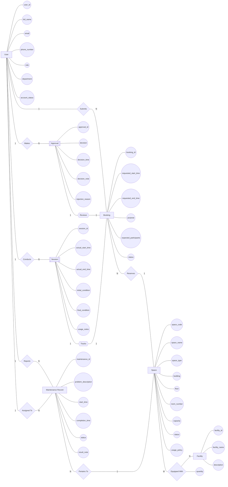

# Conceptual ERD Design

## 1. Entity Definitions

| Entity | Classification | Description |
| ------ | -------------- | ----------- |
| User | Strong | A person who interacts with the system. Has independent identity via user_id. Existence does not depend on any other entity. |
| Space | Strong | A bookable physical location on campus. Has independent identity via space_code. Existence does not depend on any other entity. |
| Facility | Strong | Equipment or amenities available in a space. Has independent identity via facility_id. Existence does not depend on any other entity. |
| Booking | Strong | A request submitted by a user to reserve a space. Has independent identity via booking_id. Existence does not depend on any other entity. |
| Approval | Weak | A decision made by facility staff or manager to approve/reject a booking. Existence depends on a Booking. Cannot exist without a corresponding booking. |
| Session | Weak | The actual usage of a space corresponding to a booking. Existence depends on an approved Booking. Cannot exist without a corresponding booking. |
| Maintenance Record | Strong | A record of a maintenance issue reported for a space. Has independent identity via maintenance_id. Existence does not depend on any other entity. |

---

## 2. Attributes

### Entity: User

| Attribute | Classification | Description | Notes |
| --------- | -------------- | ----------- | ----- |
| user_id | Key | Unique identifier for each user | Uniquely identifies each user occurrence |
| full_name | Composite | User's full name | Can be decomposed into first_name, last_name |
| email | Simple | University email address | Atomic, single value |
| phone_number | Simple | Contact phone number | Atomic, single value per entity occurrence |
| role | Simple | User role enumeration | Atomic; AM-02 notes possible multivalued if users can hold multiple roles |
| department | Simple | Organizational affiliation | Atomic |
| account_status | Simple | Account status enumeration | Atomic: active or suspended |

### Entity: Space

| Attribute | Classification | Description | Notes |
| --------- | -------------- | ----------- | ----- |
| space_code | Key | Unique identifier for the space | Uniquely identifies each space occurrence |
| space_name | Simple | Human-readable name for the space | Atomic |
| space_type | Simple | Space type enumeration | Atomic: auditorium, classroom, etc. |
| building | Simple | Building name or code | Atomic |
| floor | Simple | Floor number within the building | Atomic |
| room_number | Simple | Room identifier within the building | Atomic |
| capacity | Simple | Maximum number of occupants | Atomic, numeric |
| status | Simple | Space status enumeration | Atomic: available, in_use, under_maintenance, etc. |
| usage_policy | Simple | Rules governing space usage | Atomic |

### Entity: Facility

| Attribute | Classification | Description | Notes |
| --------- | -------------- | ----------- | ----- |
| facility_id | Key | Unique identifier for each facility type | Uniquely identifies each facility occurrence |
| facility_name | Simple | Descriptive name of the facility | Atomic |
| description | Simple | Optional details about the facility | Atomic |

### Entity: Booking

| Attribute | Classification | Description | Notes |
| --------- | -------------- | ----------- | ----- |
| booking_id | Key | Unique identifier for the booking request | Uniquely identifies each booking occurrence |
| requested_start_time | Simple | When the requester wants the booking to begin | Atomic, datetime |
| requested_end_time | Simple | When the requester wants the booking to end | Atomic, datetime |
| purpose | Simple | Purpose enumeration | Atomic: lecture, examination, seminar, etc. |
| expected_participants | Simple | Number of people expected to attend | Atomic, numeric |
| status | Simple | Booking status enumeration | Atomic: pending, approved, rejected, cancelled, checked_in, completed, no_show |

### Entity: Approval

| Attribute | Classification | Description | Notes |
| --------- | -------------- | ----------- | ----- |
| approval_id | Key | Unique identifier for the approval decision | Uniquely identifies each approval occurrence |
| decision | Simple | Decision enumeration | Atomic: approved or rejected |
| decision_time | Simple | When the decision was made | Atomic, datetime |
| decision_note | Simple | Notes accompanying the decision | Atomic |
| rejection_reason | Simple | Required if the booking was rejected | Atomic, conditional on decision = rejected |

### Entity: Session

| Attribute | Classification | Description | Notes |
| --------- | -------------- | ----------- | ----- |
| session_id | Key | Unique identifier for the session | Uniquely identifies each session occurrence |
| actual_start_time | Simple | When the space was actually occupied | Atomic, datetime |
| actual_end_time | Simple | When the usage actually ended | Atomic, datetime |
| initial_condition | Simple | Condition of the space at check-in | Atomic |
| final_condition | Simple | Condition of the space at completion | Atomic |
| usage_notes | Simple | Any notes about the usage session | Atomic |

### Entity: Maintenance Record

| Attribute | Classification | Description | Notes |
| --------- | -------------- | ----------- | ----- |
| maintenance_id | Key | Unique identifier for the maintenance record | Uniquely identifies each maintenance record occurrence |
| problem_description | Simple | Description of the issue | Atomic |
| start_time | Simple | When the maintenance was reported or started | Atomic, datetime |
| completion_time | Simple | When the maintenance was completed | Atomic, datetime, nullable |
| status | Simple | Maintenance status enumeration | Atomic: reported, in_progress, completed |
| result_note | Simple | Outcome of the maintenance work | Atomic, nullable |

---

## 4. Relationships

| Relationship | Degree | Relationship Attributes | Source Entity | Target Entity | Cardinality | Classification | Description |
| ------------ | ------ | ----------------------- | ------------- | ------------- | ----------- | -------------- | ----------- |
| submits | Binary | — | User | Booking | 1:N | Non-identifying | A user (requester) creates a booking request to reserve a space. Both entities have independent identity. |
| reserves | Binary | — | Booking | Space | N:1 | Non-identifying | A booking request reserves a specific space. Both entities have independent identity. |
| makes | Binary | — | User | Approval | 1:N | Non-identifying | A facility staff member or manager makes an approval decision. User is strong; Approval depends on Booking, not User. |
| reviews | Binary | — | Approval | Booking | 1:1 | Identifying | An approval decision reviews a specific booking. Booking contributes to the identity of Approval; Approval cannot exist without Booking. |
| conducts | Binary | — | User | Session | 1:N | Non-identifying | Facility staff conduct a usage session. User is strong; Session depends on Booking, not User. |
| tracks | Binary | — | Session | Booking | 1:1 | Identifying | A session records actual usage for an approved booking. Booking contributes to the identity of Session; Session cannot exist without Booking. |
| reports | Binary | — | User | Maintenance Record | 1:N | Non-identifying | A user reports a maintenance issue. Both entities have independent identity. |
| pertains_to | Binary | — | Maintenance Record | Space | N:1 | Non-identifying | A maintenance record describes an issue with a specific space. Both entities have independent identity. |
| equipped_with | Binary | quantity | Space | Facility | M:N | Non-identifying | A space is equipped with various facilities. Both entities have independent identity. quantity records the number of units of a facility in a space. |
| assigned_to | Binary | — | User | Maintenance Record | 1:N | Non-identifying | A facility staff member is assigned to handle a maintenance record. Both entities have independent identity. |

---

## 4. Cardinality and Participation Summary

| Relationship | Source | Source Cardinality | Source Participation | Target | Target Cardinality | Target Participation |
| ------------ | ------ | ----------------- | ------------------- | ------ | ------------------ | -------------------- |
| submits | User | 1 | Partial (user may not submit bookings) | Booking | N | Total (each booking must be submitted by a user) |
| reserves | Booking | N | Total (each booking must reserve a space) | Space | 1 | Partial (a space may not be reserved) |
| makes | User | 1 | Partial (only staff/manager may make approvals) | Approval | N | Total (each approval must be made by a user) |
| reviews | Approval | 1 | Total (each approval must review a booking) | Booking | 1 | Partial (a booking may have at most one approval) |
| conducts | User | 1 | Partial (only staff may conduct sessions) | Session | N | Total (each session must be conducted by a user) |
| tracks | Session | 1 | Total (each session must track a booking) | Booking | 1 | Partial (a booking may have at most one session) |
| reports | User | 1 | Partial (any user may report issues) | Maintenance Record | N | Total (each maintenance record must be reported by a user) |
| pertains_to | Maintenance Record | N | Total (each maintenance record must pertain to a space) | Space | 1 | Partial (a space may have multiple maintenance records) |
| equipped_with | Space | M | Partial (a space may have no facilities listed) | Facility | N | Partial (a facility may not be in any space) |
| assigned_to | User | 1 | Partial (only staff may be assigned) | Maintenance Record | N | Total (each maintenance record must be assigned to a user) |

---

## 5. Conceptual ERD Diagram

---

## 6. ERD Validation

### Entity Coverage

* [x] Every accepted entity appears in the ERD.
* [x] No rejected candidate appears as an entity.
* [x] Strong entities: User, Space, Facility, Booking, Maintenance Record.
* [x] Weak entities: Approval (dependent on Booking), Session (dependent on Booking).

### Attribute Coverage

* [x] Every major attribute appears in the ERD.
* [x] Key attributes are shown for all entities.
* [x] No derived attributes identified in the current model.
* [x] No multivalued attributes identified in the current model.
* [x] full_name classified as composite (decomposable into first_name/last_name).

### Relationship Coverage

* [x] Every relationship appears in the ERD.
* [x] Every relationship includes cardinality information.
* [x] Identifying relationships: reviews (Approval → Booking), tracks (Session → Booking).
* [x] Non-identifying relationships: submits, reserves, makes, conducts, reports, pertains_to, equipped_with, assigned_to.

### Participation Coverage

* [x] Participation constraints are documented where known.
* [x] Total participation: Booking in submits, Booking in reserves, Approval in makes, Approval in reviews, Session in conducts, Session in tracks, Maintenance Record in reports, Maintenance Record in pertains_to, Maintenance Record in assigned_to.
* [x] Partial participation: User in submits, Space in reserves, User in makes, Booking in reviews, User in conducts, Booking in tracks, User in reports, Space in pertains_to, Space in equipped_with, Facility in equipped_with, User in assigned_to.

### Conceptual Modeling Compliance

* [x] No primary keys shown.
* [x] No foreign keys shown.
* [x] No junction tables shown.
* [x] No SQL concepts shown.
* [x] Chen notation semantics preserved.
* [x] Weak entities shown in double rectangles.
* [x] Identifying relationships shown in double diamonds.

### Diagram Validation

* [x] Mermaid syntax is valid.
* [x] Mermaid Flowchart notation is used.
* [x] Mermaid ERD notation is not used.

---

## 7. Assumptions and Modeling Decisions

| ID | Assumption / Decision |
| -- | --------------------- |
| EMD-01 | Approval is classified as a Weak Entity because its existence depends entirely on a Booking. Without a booking, there is no approval decision. The reviews relationship is identifying. |
| EMD-02 | Session is classified as a Weak Entity because its existence depends entirely on an approved Booking. Without a booking, there is no session. The tracks relationship is identifying. |
| EMD-03 | Maintenance Record is classified as a Strong Entity because it has its own identity (maintenance_id) and its existence is independent of any single entity, even though it relates to Space and User. |
| EMD-04 | full_name is classified as Composite because it can be decomposed into first_name and last_name. |
| EMD-05 | phone_number is classified as Simple (single-valued) per the entity catalog. If multiple phone numbers per user are needed in the future, reclassify as Multivalued. |
| EMD-06 | role is classified as Simple pending clarification of AM-02 (whether a user can hold multiple roles). If multiple roles are allowed, reclassify as Multivalued. |
| EMD-07 | quantity is modeled as a relationship attribute of equipped_with (Space ↔ Facility, M:N) as specified in the business analysis. |
| EMD-08 | No derived attributes are present in the current model. Derived attributes such as booking_duration (from requested_start_time and requested_end_time) could be added in a future refinement. |
| EMD-09 | No multivalued attributes are present in the current model. The facility list per space is modeled as a separate entity (Facility) with an M:N relationship, consistent with assumption A-04. |

---
