# Conceptual ERD Design

## 1. Entity Definitions

| Entity | Type | Description |
| ------ | ---- | ----------- |
| User | Strong | A person who interacts with the system. Users have university accounts and can act in various roles (student, lecturer, teaching assistant, facility staff, department administrator, facility manager). |
| Space | Strong | A bookable physical location on campus managed by the School of Computer Science. |
| Facility | Strong | Equipment or amenities available in a space (projector, whiteboard, microphone, computer, livestreaming equipment, air conditioner, etc.). |
| Booking | Strong | A request submitted by a user to reserve a space for a specific time period and purpose. |
| Approval | Strong | A decision made by facility staff or manager to approve or reject a booking request. Existence depends on Booking. |
| Session | Strong | The actual usage of a space corresponding to a booking. Captures what happened in reality versus what was requested. Existence depends on Booking. |
| Maintenance Record | Strong | A record of a maintenance issue reported for a space, tracking the problem through resolution. |

### Classification Justification

| Entity | Classification | Justification |
| ------ | -------------- | ------------- |
| User | Strong | Has own identity (user_id). Existence does not depend on another entity. Can exist independently. |
| Space | Strong | Has own identity (space_code). Existence does not depend on another entity. Can exist independently. |
| Facility | Strong | Has own identity (facility_id). Existence does not depend on another entity. Can exist independently. |
| Booking | Strong | Has own identity (booking_id). Existence does not depend on another entity. Can exist independently. |
| Approval | Strong | Has own identity (approval_id). Can be uniquely identified without another entity. |
| Session | Strong | Has own identity (session_id). Can be uniquely identified without another entity. |
| Maintenance Record | Strong | Has own identity (maintenance_id). Existence does not depend on another entity. Can exist independently. |

---

## 2. Attributes

### Entity: User

| Attribute | Classification | Subattributes | Justification |
| --------- | -------------- | ------------- | ------------- |
| user_id | Key | — | Uniquely identifies each user |
| full_name | Composite | first_name, last_name | Can be meaningfully decomposed into first and last name components |
| email | Simple | — | Atomic value, cannot be meaningfully decomposed |
| phone_number | Simple | — | Atomic value |
| role | Simple | — | Atomic enumeration value |
| department | Simple | — | Atomic value |
| account_status | Simple | — | Atomic enumeration value |

---

### Entity: Space

| Attribute | Classification | Subattributes | Justification |
| --------- | -------------- | ------------- | ------------- |
| space_code | Key | — | Uniquely identifies each space |
| space_name | Simple | — | Atomic value |
| space_type | Simple | — | Atomic enumeration value |
| building | Simple | — | Atomic value |
| floor | Simple | — | Atomic value |
| room_number | Simple | — | Atomic value |
| capacity | Simple | — | Atomic numeric value |
| status | Simple | — | Atomic enumeration value |
| usage_policy | Simple | — | Atomic text value |

---

### Entity: Facility

| Attribute | Classification | Subattributes | Justification |
| --------- | -------------- | ------------- | ------------- |
| facility_id | Key | — | Uniquely identifies each facility type |
| facility_name | Simple | — | Atomic value |
| description | Simple | — | Atomic text value |

---

### Entity: Booking

| Attribute | Classification | Subattributes | Justification |
| --------- | -------------- | ------------- | ------------- |
| booking_id | Key | — | Uniquely identifies each booking request |
| requested_start_time | Simple | — | Atomic datetime value |
| requested_end_time | Simple | — | Atomic datetime value |
| purpose | Simple | — | Atomic enumeration value |
| expected_participants | Simple | — | Atomic numeric value |
| status | Simple | — | Atomic enumeration value |

---

### Entity: Approval

| Attribute | Classification | Subattributes | Justification |
| --------- | -------------- | ------------- | ------------- |
| approval_id | Key | — | Uniquely identifies each approval decision |
| decision | Simple | — | Atomic enumeration value |
| decision_time | Simple | — | Atomic datetime value |
| decision_note | Simple | — | Atomic text value |
| rejection_reason | Simple | — | Atomic text value |

---

### Entity: Session

| Attribute | Classification | Subattributes | Justification |
| --------- | -------------- | ------------- | ------------- |
| session_id | Key | — | Uniquely identifies each session |
| actual_start_time | Simple | — | Atomic datetime value |
| actual_end_time | Simple | — | Atomic datetime value |
| initial_condition | Simple | — | Atomic text value |
| final_condition | Simple | — | Atomic text value |
| usage_notes | Simple | — | Atomic text value |

---

### Entity: Maintenance Record

| Attribute | Classification | Subattributes | Justification |
| --------- | -------------- | ------------- | ------------- |
| maintenance_id | Key | — | Uniquely identifies each maintenance record |
| problem_description | Simple | — | Atomic text value |
| start_time | Simple | — | Atomic datetime value |
| completion_time | Simple | — | Atomic datetime value |
| status | Simple | — | Atomic enumeration value |
| result_note | Simple | — | Atomic text value |

---

## 3. Relationships

| Relationship | Degree | Relationship Attributes | Source Entity | Target Entity | Description |
| ------------ | ------ | ---------------------- | ------------- | ------------- | ----------- |
| submits | Binary | — | User | Booking | A user (requester) creates a booking request to reserve a space |
| reserves | Binary | — | Booking | Space | A booking request reserves a specific space for a defined time period |
| makes | Binary | — | User | Approval | A facility staff member or manager makes an approval decision on a booking request |
| reviews | Binary | — | Approval | Booking | An approval decision reviews and determines the outcome of a specific booking request |
| conducts | Binary | — | User | Session | Facility staff conduct a usage session by performing check-in and completion operations |
| tracks | Binary | — | Session | Booking | A session records the actual usage that corresponds to an approved booking |
| reports | Binary | — | User | Maintenance Record | A user reports a maintenance issue, creating a maintenance record for a space |
| pertains_to | Binary | — | Maintenance Record | Space | A maintenance record describes an issue with a specific space |
| equipped_with | Binary | quantity | Space | Facility | A space is equipped with various facilities; a facility may be available in multiple spaces |
| assigned_to | Binary | — | User | Maintenance Record | A facility staff member is assigned to handle a specific maintenance record |

### Relationship Classification

| Relationship | Classification | Justification |
| ------------ | -------------- | ------------- |
| submits | Non-identifying | Both User and Booking possess independent identity. Relationship does not contribute to entity identification. |
| reserves | Non-identifying | Both Booking and Space possess independent identity. |
| makes | Non-identifying | Both User and Approval possess independent identity. |
| reviews | Non-identifying | Both Approval and Booking possess independent identity. |
| conducts | Non-identifying | Both User and Session possess independent identity. |
| tracks | Non-identifying | Both Session and Booking possess independent identity. |
| reports | Non-identifying | Both User and Maintenance Record possess independent identity. |
| pertains_to | Non-identifying | Both Maintenance Record and Space possess independent identity. |
| equipped_with | Non-identifying | Both Space and Facility possess independent identity. |
| assigned_to | Non-identifying | Both User and Maintenance Record possess independent identity. |

---

## 4. Cardinality and Participation Summary

| Relationship | Source Cardinality | Source Participation | Target Cardinality | Target Participation |
| ------------ | ----------------- | ------------------- | ----------------- | -------------------- |
| submits | 1 (one user submits many bookings) | Partial (user may not have submitted any booking) | N (many bookings per user) | Total (every booking is submitted by exactly one user) |
| reserves | N (many bookings per space) | Total (every booking reserves exactly one space) | 1 (one space per booking) | Partial (a space may have no bookings) |
| makes | 1 (one user makes many approvals) | Partial (not all users make approvals) | N (many approvals per user) | Total (every approval is made by exactly one user) |
| reviews | 1 (one approval reviews one booking) | Total (every approval reviews exactly one booking) | 1 (one booking has at most one approval) | Partial (a booking may not have an approval yet) |
| conducts | 1 (one user conducts many sessions) | Partial (not all users conduct sessions) | N (many sessions per user) | Total (every session is conducted by exactly one user) |
| tracks | 1 (one session tracks one booking) | Total (every session tracks exactly one booking) | 1 (one booking has at most one session) | Partial (a booking may not have a session yet) |
| reports | 1 (one user reports many maintenance records) | Partial (not all users report maintenance) | N (many records per reporter) | Total (every record is reported by exactly one user) |
| pertains_to | N (many records per space) | Total (every record pertains to exactly one space) | 1 (one space per record) | Partial (a space may have no maintenance records) |
| equipped_with | M (a space may have many facilities) | Partial (a space may have no facilities listed) | N (a facility may be in many spaces) | Partial (a facility may not be in any space) |
| assigned_to | 1 (one user assigned to many records) | Partial (not all users are assigned maintenance) | N (many records per assignee) | Total (every record is assigned to exactly one user) |

---

## 5. Conceptual ERD Diagram

```mermaid
flowchart LR

%% =========================
%% Entities
%% =========================

E_User[User]
E_Space[Space]
E_Facility[Facility]
E_Booking[Booking]
E_Approval[Approval]
E_Session[Session]
E_MaintRec[Maintenance Record]

%% =========================
%% Attributes - User
%% =========================

A_U_id((<u>user_id</u>))
A_U_fullname((full_name))
A_U_fname((first_name))
A_U_lname((last_name))
A_U_email((email))
A_U_phone((phone_number))
A_U_role((role))
A_U_dept((department))
A_U_status((account_status))

%% =========================
%% Attributes - Space
%% =========================

A_S_code((<u>space_code</u>))
A_S_name((space_name))
A_S_type((space_type))
A_S_bldg((building))
A_S_floor((floor))
A_S_room((room_number))
A_S_cap((capacity))
A_S_stat((status))
A_S_policy((usage_policy))

%% =========================
%% Attributes - Facility
%% =========================

A_F_id((<u>facility_id</u>))
A_F_name((facility_name))
A_F_desc((description))

%% =========================
%% Attributes - Booking
%% =========================

A_B_id((<u>booking_id</u>))
A_B_start((requested_start_time))
A_B_end((requested_end_time))
A_B_purpose((purpose))
A_B_parts((expected_participants))
A_B_status((status))

%% =========================
%% Attributes - Approval
%% =========================

A_A_id((<u>approval_id</u>))
A_A_dec((decision))
A_A_time((decision_time))
A_A_note((decision_note))
A_A_reason((rejection_reason))

%% =========================
%% Attributes - Session
%% =========================

A_Sess_id((<u>session_id</u>))
A_Sess_start((actual_start_time))
A_Sess_end((actual_end_time))
A_Sess_init((initial_condition))
A_Sess_final((final_condition))
A_Sess_notes((usage_notes))

%% =========================
%% Attributes - Maintenance Record
%% =========================

A_M_id((<u>maintenance_id</u>))
A_M_problem((problem_description))
A_M_start((start_time))
A_M_comp((completion_time))
A_M_status((status))
A_M_note((result_note))

%% =========================
%% Relationships
%% =========================

R_submits{submits}
R_reserves{reserves}
R_makes{makes}
R_reviews{reviews}
R_conducts{conducts}
R_tracks{tracks}
R_reports{reports}
R_pertains{pertains_to}
R_equipped{equipped_with}
RA_quantity((quantity))
R_assigned{assigned_to}

%% =========================
%% Entity-Attribute Links - User
%% =========================

E_User --- A_U_id
E_User --- A_U_fullname
A_U_fullname --- A_U_fname
A_U_fullname --- A_U_lname
E_User --- A_U_email
E_User --- A_U_phone
E_User --- A_U_role
E_User --- A_U_dept
E_User --- A_U_status

%% =========================
%% Entity-Attribute Links - Space
%% =========================

E_Space --- A_S_code
E_Space --- A_S_name
E_Space --- A_S_type
E_Space --- A_S_bldg
E_Space --- A_S_floor
E_Space --- A_S_room
E_Space --- A_S_cap
E_Space --- A_S_stat
E_Space --- A_S_policy

%% =========================
%% Entity-Attribute Links - Facility
%% =========================

E_Facility --- A_F_id
E_Facility --- A_F_name
E_Facility --- A_F_desc

%% =========================
%% Entity-Attribute Links - Booking
%% =========================

E_Booking --- A_B_id
E_Booking --- A_B_start
E_Booking --- A_B_end
E_Booking --- A_B_purpose
E_Booking --- A_B_parts
E_Booking --- A_B_status

%% =========================
%% Entity-Attribute Links - Approval
%% =========================

E_Approval --- A_A_id
E_Approval --- A_A_dec
E_Approval --- A_A_time
E_Approval --- A_A_note
E_Approval --- A_A_reason

%% =========================
%% Entity-Attribute Links - Session
%% =========================

E_Session --- A_Sess_id
E_Session --- A_Sess_start
E_Session --- A_Sess_end
E_Session --- A_Sess_init
E_Session --- A_Sess_final
E_Session --- A_Sess_notes

%% =========================
%% Entity-Attribute Links - Maintenance Record
%% =========================

E_MaintRec --- A_M_id
E_MaintRec --- A_M_problem
E_MaintRec --- A_M_start
E_MaintRec --- A_M_comp
E_MaintRec --- A_M_status
E_MaintRec --- A_M_note

%% =========================
%% Relationship Links
%% =========================

E_User -- "1" --- R_submits
R_submits -- "N" --- E_Booking

E_Booking -- "N" --- R_reserves
R_reserves -- "1" --- E_Space

E_User -- "1" --- R_makes
R_makes -- "N" --- E_Approval

E_Approval -- "1" --- R_reviews
R_reviews -- "1" --- E_Booking

E_User -- "1" --- R_conducts
R_conducts -- "N" --- E_Session

E_Session -- "1" --- R_tracks
R_tracks -- "1" --- E_Booking

E_User -- "1" --- R_reports
R_reports -- "N" --- E_MaintRec

E_MaintRec -- "N" --- R_pertains
R_pertains -- "1" --- E_Space

E_Space -- "M" --- R_equipped
R_equipped -- "N" --- E_Facility
R_equipped --- RA_quantity

E_User -- "1" --- R_assigned
R_assigned -- "N" --- E_MaintRec
```

---

## 6. ERD Validation

### Entity Coverage

* [X] Every accepted entity appears in the ERD.
* [X] No rejected candidate appears as an entity.

### Attribute Coverage

* [X] Every major attribute appears in the ERD.
* [X] Subattributes of composite attribute are represented.

### Relationship Coverage

* [X] Every relationship appears in the ERD.
* [X] Every relationship includes cardinality information.

### Participation Coverage

* [X] Participation constraints are documented where known.

### Conceptual Modeling Compliance

* [X] No primary keys shown.
* [X] No foreign keys shown.
* [X] No junction tables shown.
* [X] No SQL concepts shown.
* [X] Chen notation semantics preserved.

### Diagram Validation

* [X] Mermaid syntax is valid.
* [X] Mermaid Flowchart notation is used.
* [X] Mermaid ERD notation is not used.

---

## 7. Assumptions

| ID | Assumption |
| -- | ---------- |
| ERD-A01 | All entities are classified as Strong because each possesses a unique identifier that can independently identify entity occurrences. |
| ERD-A02 | The `full_name` attribute of User is classified as Composite and decomposed into `first_name` and `last_name` subattributes, even though the business analysis lists it as a single attribute, because it can be meaningfully decomposed. |
| ERD-A03 | All relationships are Non-identifying because all participating entities are Strong and possess independent identity. |
| ERD-A04 | No Derived attributes are present in the current model — all attribute values require explicit storage. |
| ERD-A05 | No Multivalued attributes are present — all multi-value concepts (e.g., facilities per space) are modeled as separate entities with relationships. |
| ERD-A06 | The `quantity` attribute on the `equipped_with` relationship is the only relationship attribute in the model. |
| ERD-A07 | Cardinality labels in the ERD diagram use simplified notation (e.g., "1", "N") following Chen convention rather than explicit labels like "1..N" or "0..N". |
