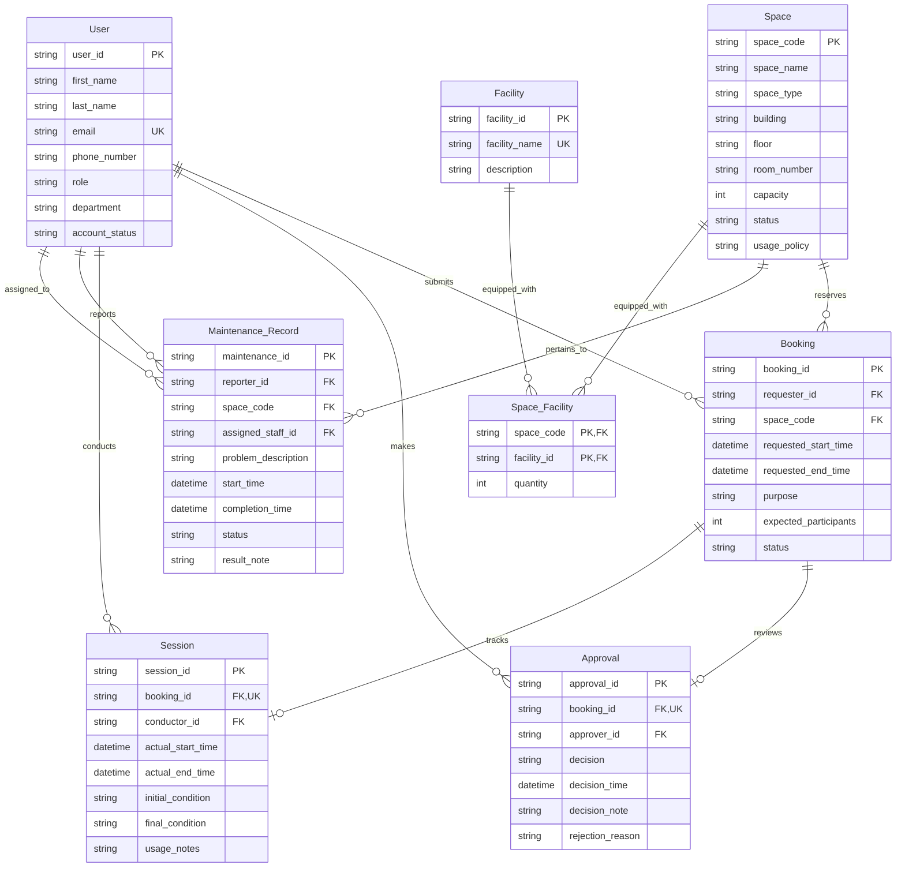

# Logical Database Design

# 1. Mapping Inventory

## Entities

| Entity | Type | Identifier |
|----------|----------|----------|
| User | Strong | user_id |
| Space | Strong | space_code |
| Facility | Strong | facility_id |
| Booking | Strong | booking_id |
| Approval | Strong | approval_id |
| Session | Strong | session_id |
| Maintenance Record | Strong | maintenance_id |

---

## Relationships

| Relationship | Cardinality | Attributes |
|-------------|-------------|-------------|
| submits | 1:N | - |
| reserves | N:1 | - |
| makes | 1:N | - |
| reviews | 1:1 | - |
| conducts | 1:N | - |
| tracks | 1:1 | - |
| reports | 1:N | - |
| pertains_to | N:1 | - |
| equipped_with | M:N | quantity |
| assigned_to | 1:N | - |

---

## Special Constructs

### Weak Entities

None identified.

### Multivalued Attributes

None identified.

### Composite Attributes

| Owner | Attribute | Component Attributes |
|---------|---------|---------------------|
| User | full_name | first_name, last_name |

### Recursive Relationships

None identified.

### Specialization Structures

None identified.

---

# 2. Entity Mapping

## Strong Entities

| Entity | Relation | PK | Candidate Keys |
|----------|----------|----------|----------|
| User | User | user_id | email |
| Space | Space | space_code | (building, floor, room_number) |
| Facility | Facility | facility_id | facility_name |
| Booking | Booking | booking_id | - |
| Approval | Approval | approval_id | - |
| Session | Session | session_id | - |
| Maintenance Record | Maintenance_Record | maintenance_id | - |

### Decisions

- **Rule 1 (Strong Entity Mapping)** applied to all strong entities, including Approval and Session.
- Approval and Session are classified as strong entities per the ERD: each possesses its own unique identifier (approval_id, session_id) and does not depend on another entity for identity.
- **Rule 8 (Composite Attribute Mapping):** full_name decomposed into first_name and last_name.
- **Rule 13 (Derived Attributes):** No derived attributes are stored. booking_duration and similar computed values are excluded per requirement analysis.
- **Rule 11 (Candidate Key Preservation):** User.email preserved as candidate key (unique university email). Space (building, floor, room_number) preserved as candidate key (physical location uniqueness). Facility.facility_name preserved as candidate key.

---

# 3. Relationship Mapping

## Binary 1:1 Relationships

| Relationship | Strategy | Result |
|-------------|-------------|-------------|
| reviews (Approval ↔ Booking) | FK in total participation side (Rule 3) | booking_id in Approval as FK with UNIQUE constraint |
| tracks (Session ↔ Booking) | FK in total participation side (Rule 3) | booking_id in Session as FK with UNIQUE constraint |

### Rationale

**Rule 3 (Binary 1:1 Mapping):** The preferred approach is to place a FK in the relation with total participation.

- **reviews:** Approval has total participation (every approval must review exactly one booking, BR-11); Booking has partial participation (a booking may have at most one approval, BR-09). FK `booking_id` is placed in Approval. A UNIQUE constraint on `booking_id` enforces the 1:1 cardinality.
- **tracks:** Session has total participation (every session must track exactly one booking, BR-12); Booking has partial participation (a booking may have at most one session, BR-10). FK `booking_id` is placed in Session. A UNIQUE constraint on `booking_id` enforces the 1:1 cardinality.

Both Approval and Session are strong entities with their own simple primary keys (`approval_id`, `session_id`). The relationships are non-identifying per the ERD.

---

## Binary 1:N Relationships

| Relationship | FK Placement |
|-------------|-------------|
| submits (User → Booking) | user_id (as requester_id) in Booking → User(user_id) |
| reserves (Booking → Space) | space_code in Booking → Space(space_code) |
| makes (User → Approval) | user_id (as approver_id) in Approval → User(user_id) |
| conducts (User → Session) | user_id (as conductor_id) in Session → User(user_id) |
| reports (User → Maintenance Record) | user_id (as reporter_id) in Maintenance_Record → User(user_id) |
| pertains_to (Maintenance Record → Space) | space_code in Maintenance_Record → Space(space_code) |
| assigned_to (User → Maintenance Record) | user_id (as assigned_staff_id) in Maintenance_Record → User(user_id) |

### Rationale

**Rule 4 (Binary 1:N Mapping):** The PK of the 1-side entity is placed as a FK in the N-side relation. No separate relation is needed.

- submits: User is 1-side, Booking is N-side → FK in Booking.
- reserves: Space is 1-side, Booking is N-side → FK in Booking.
- makes: User is 1-side, Approval is N-side → FK in Approval.
- conducts: User is 1-side, Session is N-side → FK in Session.
- reports: User is 1-side, Maintenance_Record is N-side → FK in Maintenance_Record.
- pertains_to: Space is 1-side, Maintenance_Record is N-side → FK in Maintenance_Record.
- assigned_to: User is 1-side, Maintenance_Record is N-side → FK in Maintenance_Record.

---

## Binary M:N Relationships

| Relationship | Associative Relation |
|-------------|-------------|
| equipped_with (Space ↔ Facility) | Space_Facility |

### Rationale

**Rule 5 (Binary M:N Mapping):** The equipped_with relationship involves quantity as a relationship attribute. An associative relation Space_Facility is created with:
- FK: space_code → Space(space_code)
- FK: facility_id → Facility(facility_id)
- PK: (space_code, facility_id)
- Attribute: quantity

---

## N-ary Relationships

None identified.

---

## Recursive Relationships

None identified.

---

# 4. Special Construct Resolution

## Composite Attributes

| Attribute | Resolution |
|-----------|-----------|
| User.full_name | Decomposed into first_name and last_name as simple attributes of User relation |

### Rationale

**Rule 8 (Composite Attribute Mapping):** The composite attribute full_name is replaced by its simple component attributes first_name and last_name. The composite attribute itself is not retained in the relation.

---

## Multivalued Attributes

None identified.

---

## Derived Attributes

| Attribute | Stored | Rationale |
|-----------|-----------|-----------|
| (none) | N/A | No derived attributes are stored per Rule 13. All required summary information can be computed from stored attributes. |

---

## Generalization / Specialization

None identified.

---

# 5. Foreign Key Analysis

| Relation | Foreign Key | References |
|----------|------------|------------|
| Booking | user_id (requester_id) | User(user_id) |
| Booking | space_code | Space(space_code) |
| Approval | booking_id (UNIQUE) | Booking(booking_id) |
| Approval | user_id (approver_id) | User(user_id) |
| Session | booking_id (UNIQUE) | Booking(booking_id) |
| Session | user_id (conductor_id) | User(user_id) |
| Maintenance_Record | user_id (reporter_id) | User(user_id) |
| Maintenance_Record | space_code | Space(space_code) |
| Maintenance_Record | user_id (assigned_staff_id) | User(user_id) |
| Space_Facility | space_code | Space(space_code) |
| Space_Facility | facility_id | Facility(facility_id) |

### Referential Integrity Summary

- Booking.user_id references User.user_id — ensures every booking is submitted by a valid user.
- Booking.space_code references Space.space_code — ensures every booking reserves a valid space.
- Approval.booking_id references Booking.booking_id — ensures every approval corresponds to an existing booking (non-identifying 1:1 relationship; UNIQUE enforces 1:1 cardinality).
- Approval.user_id references User.user_id — ensures every approval decision is made by a valid user.
- Session.booking_id references Booking.booking_id — ensures every session corresponds to an existing booking (non-identifying 1:1 relationship; UNIQUE enforces 1:1 cardinality).
- Session.user_id references User.user_id — ensures every session is conducted by a valid user.
- Maintenance_Record.reporter_id references User.user_id — ensures every maintenance record is reported by a valid user.
- Maintenance_Record.space_code references Space.space_code — ensures every maintenance record is associated with a valid space.
- Maintenance_Record.assigned_staff_id references User.user_id — ensures every maintenance record is assigned to a valid user.
- Space_Facility.space_code references Space.space_code — ensures facility associations reference valid spaces.
- Space_Facility.facility_id references Facility.facility_id — ensures facility associations reference valid facilities.

---

# 6. Candidate Key Analysis

| Relation | Candidate Key | Justification |
|----------|----------|----------|
| User | email | University email must be unique per user (BR-01). |
| Space | (building, floor, room_number) | Physical location combination must uniquely identify a space. |
| Facility | facility_name | Facility names are unique descriptors of equipment types. |

---

# 7. Integrity Constraint Analysis

## Entity Integrity

Each relation has a defined primary key that uniquely identifies every tuple and does not permit NULL values.

| Relation | Primary Key | Constraint Description |
|----------|-------------|----------------------|
| User | user_id | NOT NULL, UNIQUE |
| Space | space_code | NOT NULL, UNIQUE |
| Facility | facility_id | NOT NULL, UNIQUE |
| Booking | booking_id | NOT NULL, UNIQUE |
| Approval | approval_id | NOT NULL, UNIQUE |
| Session | session_id | NOT NULL, UNIQUE |
| Maintenance_Record | maintenance_id | NOT NULL, UNIQUE |
| Space_Facility | (space_code, facility_id) | NOT NULL, UNIQUE |

---

## Referential Integrity

| Referencing Relation | Referencing Attribute | Referenced Relation | Referenced Attribute | Constraint Description |
|---------------------|---------------------|-------------------|---------------------|----------------------|
| Booking | user_id | User | user_id | FK NOT NULL (total participation of Booking in submits) |
| Booking | space_code | Space | space_code | FK NOT NULL (total participation of Booking in reserves) |
| Approval | booking_id | Booking | booking_id | FK NOT NULL, UNIQUE (total participation in reviews; UNIQUE enforces 1:1) |
| Approval | user_id | User | user_id | FK NOT NULL (total participation of Approval in makes) |
| Session | booking_id | Booking | booking_id | FK NOT NULL, UNIQUE (total participation in tracks; UNIQUE enforces 1:1) |
| Session | user_id | User | user_id | FK NOT NULL (total participation of Session in conducts) |
| Maintenance_Record | reporter_id | User | user_id | FK NOT NULL (total participation in reports) |
| Maintenance_Record | space_code | Space | space_code | FK NOT NULL (total participation in pertains_to) |
| Maintenance_Record | assigned_staff_id | User | user_id | FK NOT NULL (total participation in assigned_to) |
| Space_Facility | space_code | Space | space_code | FK NOT NULL |
| Space_Facility | facility_id | Facility | facility_id | FK NOT NULL |

---

## Business Key Constraints

| Relation | Candidate Key | Constraint |
|----------|--------------|-----------|
| User | email | UNIQUE constraint |
| Space | (building, floor, room_number) | UNIQUE constraint on the composite |
| Facility | facility_name | UNIQUE constraint |

---

# 8. Relational Schema Diagram

---

# 9. Mapping Completeness Verification

| Criterion | Status |
|-----------|--------|
| Every entity mapped to a relation | ✓ All 7 entities mapped (all strong) |
| Every attribute mapped | ✓ All attributes mapped; full_name decomposed into first_name, last_name |
| Every identifier preserved | ✓ All PKs defined; no composite PKs for weak entities |
| Every relationship represented | ✓ All 10 relationships represented |
| 1:1 relationships mapped correctly | ✓ reviews and tracks mapped via FK + UNIQUE (Rule 3) |
| 1:N relationships mapped correctly | ✓ All 1:N relationships mapped via FK on N-side |
| M:N relationships mapped correctly | ✓ equipped_with resolved via Space_Facility associative relation |
| Composite attributes decomposed | ✓ full_name decomposed into first_name and last_name |
| Multivalued attributes resolved | ✓ None identified |
| Weak entities mapped correctly | ✓ None identified in this design |
| Recursive relationships mapped | ✓ None identified |
| Relationship attributes preserved | ✓ quantity preserved in Space_Facility |
| Foreign keys identified | ✓ All 11 FK references documented |
| Candidate keys documented | ✓ 3 candidate keys documented |
| Referential integrity represented | ✓ All FK constraints documented |
| No implementation-specific details | ✓ No SQL, no DBMS-specific syntax |
| Logical schema internally consistent | ✓ All references verified; bidirectional traceability maintained |

## Assumptions

| ID | Assumption |
|----|-----------|
| LD-01 | Role names are assigned to foreign keys to disambiguate multiple FKs referencing the same relation (User). Role names: requester_id, approver_id, conductor_id, reporter_id, assigned_staff_id. In the relational schema, these are stored as user_id with clear role documentation. |
| LD-02 | No artificial candidate keys are introduced. Business-defined candidate keys are preserved as documented from the conceptual analysis. |
| LD-03 | Space_Facility PK is (space_code, facility_id) — a composite of both participating FKs per Rule 5. This prevents duplicate entries for the same facility in the same space. |
| LD-04 | Approval and Session are classified as strong entities per the ERD. Each has its own unique identifier (approval_id, session_id) and does not depend on Booking for identity. The 1:1 relationships (reviews, tracks) are captured via FK with UNIQUE constraint rather than composite PK. |
