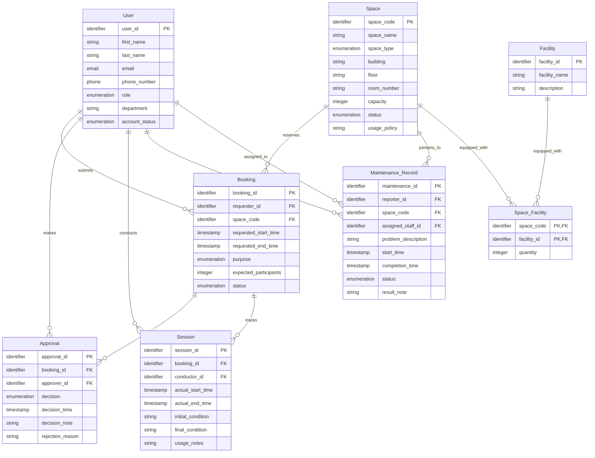

# Logical Database Design

# 1. Mapping Inventory

## Entities

| Entity | Type | Identifier |
|----------|----------|----------|
| User | Strong | user_id |
| Space | Strong | space_code |
| Facility | Strong | facility_id |
| Booking | Strong | booking_id |
| Approval | Strong | approval_id |
| Session | Strong | session_id |
| Maintenance Record | Strong | maintenance_id |

---

## Relationships

| Relationship | Cardinality | Attributes |
|-------------|-------------|-------------|
| submits | 1:N | - |
| reserves | N:1 | - |
| makes | 1:N | - |
| reviews | 1:1 | - |
| conducts | 1:N | - |
| tracks | 1:1 | - |
| reports | 1:N | - |
| pertains_to | N:1 | - |
| equipped_with | M:N | quantity |
| assigned_to | 1:N | - |

---

## Special Constructs

### Weak Entities

None identified.

### Multivalued Attributes

None identified.

### Composite Attributes

| Owner | Attribute | Component Attributes |
|---------|---------|---------------------|
| User | full_name | first_name, last_name |

### Recursive Relationships

None identified.

### Specialization Structures

None identified.

---

# 2. Entity Mapping

## Strong Entities

| Entity | Relation | PK | Candidate Keys |
|----------|----------|----------|----------|
| User | User | user_id | email |
| Space | Space | space_code | (building, floor, room_number) |
| Facility | Facility | facility_id | facility_name |
| Booking | Booking | booking_id | - |
| Approval | Approval | approval_id | - |
| Session | Session | session_id | - |
| Maintenance Record | Maintenance_Record | maintenance_id | - |

### Decisions

- **Rule 1 (Strong Entity Mapping)** applied to all strong entities, including Approval and Session.
- Approval and Session are classified as strong entities per the ERD: each possesses its own unique identifier (approval_id, session_id) and does not depend on another entity for identity.
- **Rule 8 (Composite Attribute Mapping):** full_name decomposed into first_name and last_name.
- **Rule 13 (Derived Attributes):** No derived attributes are stored. booking_duration and similar computed values are excluded per requirement analysis.
- **Rule 11 (Candidate Key Preservation):** User.email preserved as candidate key (unique university email). Space (building, floor, room_number) preserved as candidate key (physical location uniqueness). Facility.facility_name preserved as candidate key.

---

## Weak Entities

None identified.

### Decisions

- No weak entities exist in the conceptual model. All entities are strong per ERD classification (ERD-A01).

---

# 3. Attribute Catalog

Logical domains are used per Rule 14. "Conditional" nullability means the attribute is NULL until the lifecycle stage that requires it.

| Relation | Attribute | Logical Domain | Nullable | Allowed Values / Range | Default | Notes |
|----------|-----------|----------------|----------|------------------------|---------|------|
| User | user_id | Identifier | No | — | — | Primary key |
| User | first_name | String(100) | No | — | — | Component of full_name (Rule 8) |
| User | last_name | String(100) | No | — | — | Component of full_name (Rule 8) |
| User | email | Email | No | University email pattern | — | Candidate key (BR-01) |
| User | phone_number | Phone | Yes | — | — | Not required by business requirements |
| User | role | Enumeration | No | student, lecturer, teaching_assistant, facility_staff, department_administrator, facility_manager | — | BR-02 |
| User | department | String(100) | Yes | — | — | Not required by business requirements |
| User | account_status | Enumeration | No | active, suspended | active (inferred) | Inferred default per BR-20 (only active accounts act) |
| Space | space_code | Identifier | No | — | — | Primary key |
| Space | space_name | String(200) | No | — | — | |
| Space | space_type | Enumeration | No | auditorium, classroom, computer_laboratory, project_laboratory, meeting_room, student_workspace | — | |
| Space | building | String(100) | No | — | — | Part of candidate key (building, floor, room_number) |
| Space | floor | String(10) | No | — | — | Modeled as string to allow labels such as "B1" (LD-05); part of candidate key |
| Space | room_number | String(50) | No | — | — | Part of candidate key |
| Space | capacity | Integer | No | >= 1 | — | Maximum occupants; constrains expected_participants (BR-40) |
| Space | status | Enumeration | No | available, in_use, under_maintenance, temporarily_closed, retired | available (inferred) | BR-03; unbookable statuses per BR-32 |
| Space | usage_policy | String(1000) | Yes | — | — | Not required by business requirements |
| Facility | facility_id | Identifier | No | — | — | Primary key |
| Facility | facility_name | String(100) | No | — | — | Candidate key |
| Facility | description | String(500) | Yes | — | — | Optional details |
| Booking | booking_id | Identifier | No | — | — | Primary key |
| Booking | requester_id | Identifier | No | — | — | FK → User(user_id); role name (LD-01); total participation in submits |
| Booking | space_code | Identifier | No | — | — | FK → Space(space_code); total participation in reserves |
| Booking | requested_start_time | Timestamp | No | In the future (BR-36) | — | |
| Booking | requested_end_time | Timestamp | No | After requested_start_time (BR-35) | — | |
| Booking | purpose | Enumeration | No | lecture, examination, seminar, workshop, meeting, student_activity, administrative_event | — | BR-04 |
| Booking | expected_participants | Integer | No | >= 1 and <= space capacity | — | BR-40 |
| Booking | status | Enumeration | No | pending, approved, rejected, cancelled, checked_in, completed, no_show | pending (inferred) | BR-05; default inferred from lifecycle (BR-24) |
| Approval | approval_id | Identifier | No | — | — | Primary key |
| Approval | booking_id | Identifier | No | — | — | FK → Booking(booking_id); UNIQUE enforces 1:1 reviews |
| Approval | approver_id | Identifier | No | — | — | FK → User(user_id); role name (LD-01) |
| Approval | decision | Enumeration | No | approved, rejected | — | |
| Approval | decision_time | Timestamp | No | Before booking requested_start_time (BR-37) | — | |
| Approval | decision_note | String(500) | Yes | — | — | Not required by business requirements |
| Approval | rejection_reason | String(500) | Conditional | — | — | Required when decision = rejected (BR-29, BR-41) |
| Session | session_id | Identifier | No | — | — | Primary key |
| Session | booking_id | Identifier | No | — | — | FK → Booking(booking_id); UNIQUE enforces 1:1 tracks |
| Session | conductor_id | Identifier | No | — | — | FK → User(user_id); role name (LD-01); facility staff only (BR-22) |
| Session | actual_start_time | Timestamp | Conditional | Before actual_end_time (BR-38) | — | Required at check-in (BR-30) |
| Session | actual_end_time | Timestamp | Conditional | After actual_start_time (BR-38) | — | Required at completion (BR-31) |
| Session | initial_condition | String(500) | Conditional | — | — | Required at check-in (BR-30) |
| Session | final_condition | String(500) | Conditional | — | — | Required at completion (BR-31) |
| Session | usage_notes | String(1000) | Conditional | — | — | Required at completion (BR-31) |
| Maintenance_Record | maintenance_id | Identifier | No | — | — | Primary key |
| Maintenance_Record | reporter_id | Identifier | No | — | — | FK → User(user_id); role name (LD-01); may differ from assigned_staff_id (BR-18) |
| Maintenance_Record | space_code | Identifier | No | — | — | FK → Space(space_code) |
| Maintenance_Record | assigned_staff_id | Identifier | No | — | — | FK → User(user_id); role name (LD-01); facility staff only (BR-23) |
| Maintenance_Record | problem_description | String(1000) | No | — | — | |
| Maintenance_Record | start_time | Timestamp | No | — | — | When the issue is reported |
| Maintenance_Record | completion_time | Timestamp | Conditional | After start_time (BR-39) | — | Required when status = completed (BR-34) |
| Maintenance_Record | status | Enumeration | No | reported, in_progress, completed | reported (inferred) | Inferred default per lifecycle (BR-34) |
| Maintenance_Record | result_note | String(1000) | Conditional | — | — | Required when status = completed (BR-34) |
| Space_Facility | space_code | Identifier | No | — | — | PK part; FK → Space(space_code) |
| Space_Facility | facility_id | Identifier | No | — | — | PK part; FK → Facility(facility_id) |
| Space_Facility | quantity | Integer | No | >= 1 | — | Relationship attribute of equipped_with; units of facility per space |

---

# 4. Relationship Mapping

## Binary 1:1 Relationships

| Relationship | Strategy | Result |
|-------------|-------------|-------------|
| reviews (Approval ↔ Booking) | FK in total participation side (Rule 3) | booking_id in Approval as FK with UNIQUE constraint |
| tracks (Session ↔ Booking) | FK in total participation side (Rule 3) | booking_id in Session as FK with UNIQUE constraint |

### Rationale

**Rule 3 (Binary 1:1 Mapping):** The preferred approach is to place a FK in the relation with total participation.

- **reviews:** Approval has total participation (every approval must review exactly one booking, BR-11); Booking has partial participation (a booking may have at most one approval, BR-09). FK `booking_id` is placed in Approval. A UNIQUE constraint on `booking_id` enforces the 1:1 cardinality.
- **tracks:** Session has total participation (every session must track exactly one booking, BR-12); Booking has partial participation (a booking may have at most one session, BR-10). FK `booking_id` is placed in Session. A UNIQUE constraint on `booking_id` enforces the 1:1 cardinality.

Both Approval and Session are strong entities with their own simple primary keys (`approval_id`, `session_id`). The relationships are non-identifying per the ERD.

---

## Binary 1:N Relationships

| Relationship | FK Placement |
|-------------|-------------|
| submits (User → Booking) | user_id (as requester_id) in Booking → User(user_id) |
| reserves (Booking → Space) | space_code in Booking → Space(space_code) |
| makes (User → Approval) | user_id (as approver_id) in Approval → User(user_id) |
| conducts (User → Session) | user_id (as conductor_id) in Session → User(user_id) |
| reports (User → Maintenance Record) | user_id (as reporter_id) in Maintenance_Record → User(user_id) |
| pertains_to (Maintenance Record → Space) | space_code in Maintenance_Record → Space(space_code) |
| assigned_to (User → Maintenance Record) | user_id (as assigned_staff_id) in Maintenance_Record → User(user_id) |

### Rationale

**Rule 4 (Binary 1:N Mapping):** The PK of the 1-side entity is placed as a FK in the N-side relation. No separate relation is needed.

- submits: User is 1-side, Booking is N-side → FK in Booking.
- reserves: Space is 1-side, Booking is N-side → FK in Booking.
- makes: User is 1-side, Approval is N-side → FK in Approval.
- conducts: User is 1-side, Session is N-side → FK in Session.
- reports: User is 1-side, Maintenance_Record is N-side → FK in Maintenance_Record.
- pertains_to: Space is 1-side, Maintenance_Record is N-side → FK in Maintenance_Record.
- assigned_to: User is 1-side, Maintenance_Record is N-side → FK in Maintenance_Record.

---

## Binary M:N Relationships

| Relationship | Associative Relation |
|-------------|-------------|
| equipped_with (Space ↔ Facility) | Space_Facility |

### Rationale

**Rule 5 (Binary M:N Mapping):** The equipped_with relationship involves quantity as a relationship attribute. An associative relation Space_Facility is created with:
- FK: space_code → Space(space_code)
- FK: facility_id → Facility(facility_id)
- PK: (space_code, facility_id)
- Attribute: quantity

---

## N-ary Relationships

None identified.

### Rationale

No relationship in the conceptual ERD involves more than two participating entities.

---

## Recursive Relationships

None identified.

### Rationale

No recursive relationship exists in the conceptual ERD (Rule 10 not applicable).

---

# 5. Special Construct Resolution

## Composite Attributes

| Attribute | Resolution |
|-----------|-----------|
| User.full_name | Decomposed into first_name and last_name as simple attributes of User relation |

### Rationale

**Rule 8 (Composite Attribute Mapping):** The composite attribute full_name is replaced by its simple component attributes first_name and last_name. The composite attribute itself is not retained in the relation.

---

## Multivalued Attributes

None identified.

### Rationale

Facilities per space are modeled as the M:N relationship equipped_with (A-04, ERD-A05), resolved through the Space_Facility associative relation.

---

## Derived Attributes

| Attribute | Stored | Rationale |
|-----------|-----------|-----------|
| (none) | N/A | No derived attributes are stored per Rule 13. All required summary information can be computed from stored attributes. |

---

## Generalization / Specialization

None identified.

### Strategy

No inheritance mapping strategy applies: the conceptual model contains no generalization or specialization structures, so no relation is converted to a supertype/subtype representation.

### Rationale

No specialization or generalization structures exist in the conceptual model; roles are modeled as a single-valued enumeration attribute of User (AM-02 assumption).

---

# 6. Foreign Key Analysis

| Relation | Foreign Key | References |
|----------|------------|------------|
| Booking | requester_id | User(user_id) |
| Booking | space_code | Space(space_code) |
| Approval | booking_id (UNIQUE) | Booking(booking_id) |
| Approval | approver_id | User(user_id) |
| Session | booking_id (UNIQUE) | Booking(booking_id) |
| Session | conductor_id | User(user_id) |
| Maintenance_Record | reporter_id | User(user_id) |
| Maintenance_Record | space_code | Space(space_code) |
| Maintenance_Record | assigned_staff_id | User(user_id) |
| Space_Facility | space_code | Space(space_code) |
| Space_Facility | facility_id | Facility(facility_id) |

### Referential Integrity Summary

- Booking.requester_id references User.user_id — ensures every booking is submitted by a valid user.
- Booking.space_code references Space.space_code — ensures every booking reserves a valid space.
- Approval.booking_id references Booking.booking_id — ensures every approval corresponds to an existing booking (non-identifying 1:1 relationship; UNIQUE enforces 1:1 cardinality).
- Approval.approver_id references User.user_id — ensures every approval decision is made by a valid user.
- Session.booking_id references Booking.booking_id — ensures every session corresponds to an existing booking (non-identifying 1:1 relationship; UNIQUE enforces 1:1 cardinality).
- Session.conductor_id references User.user_id — ensures every session is conducted by a valid user.
- Maintenance_Record.reporter_id references User.user_id — ensures every maintenance record is reported by a valid user.
- Maintenance_Record.space_code references Space.space_code — ensures every maintenance record is associated with a valid space.
- Maintenance_Record.assigned_staff_id references User.user_id — ensures every maintenance record is assigned to a valid user.
- Space_Facility.space_code references Space.space_code — ensures facility associations reference valid spaces.
- Space_Facility.facility_id references Facility.facility_id — ensures facility associations reference valid facilities.

---

# 7. Candidate Key Analysis

| Relation | Candidate Key | Justification |
|----------|----------|----------|
| User | email | University email must be unique per user (BR-01). |
| Space | (building, floor, room_number) | Physical location combination must uniquely identify a space. |
| Facility | facility_name | Facility names are unique descriptors of equipment types. |

---

# 8. Integrity Constraint Analysis

## Entity Integrity

Each relation has a defined primary key that uniquely identifies every tuple and does not permit NULL values.

| Relation | Primary Key | Constraint Description |
|----------|-------------|----------------------|
| User | user_id | NOT NULL, UNIQUE |
| Space | space_code | NOT NULL, UNIQUE |
| Facility | facility_id | NOT NULL, UNIQUE |
| Booking | booking_id | NOT NULL, UNIQUE |
| Approval | approval_id | NOT NULL, UNIQUE |
| Session | session_id | NOT NULL, UNIQUE |
| Maintenance_Record | maintenance_id | NOT NULL, UNIQUE |
| Space_Facility | (space_code, facility_id) | NOT NULL, UNIQUE |

---

## Referential Integrity

| Referencing Relation | Referencing Attribute | Referenced Relation | Referenced Attribute | Constraint Description |
|---------------------|---------------------|-------------------|---------------------|----------------------|
| Booking | requester_id | User | user_id | FK NOT NULL (total participation of Booking in submits) |
| Booking | space_code | Space | space_code | FK NOT NULL (total participation of Booking in reserves) |
| Approval | booking_id | Booking | booking_id | FK NOT NULL, UNIQUE (total participation in reviews; UNIQUE enforces 1:1) |
| Approval | approver_id | User | user_id | FK NOT NULL (total participation of Approval in makes) |
| Session | booking_id | Booking | booking_id | FK NOT NULL, UNIQUE (total participation in tracks; UNIQUE enforces 1:1) |
| Session | conductor_id | User | user_id | FK NOT NULL (total participation of Session in conducts) |
| Maintenance_Record | reporter_id | User | user_id | FK NOT NULL (total participation in reports) |
| Maintenance_Record | space_code | Space | space_code | FK NOT NULL (total participation in pertains_to) |
| Maintenance_Record | assigned_staff_id | User | user_id | FK NOT NULL (total participation in assigned_to) |
| Space_Facility | space_code | Space | space_code | FK NOT NULL |
| Space_Facility | facility_id | Facility | facility_id | FK NOT NULL |

---

## Business Key Constraints

| Relation | Candidate Key | Constraint |
|----------|--------------|-----------|
| User | email | UNIQUE constraint |
| Space | (building, floor, room_number) | UNIQUE constraint on the composite |
| Facility | facility_name | UNIQUE constraint |

---

## Cross-Relation Business Constraints

Logical constraints that span multiple relations (or involve temporal conditions within one relation) cannot be expressed as simple primary key, unique, or foreign key constraints. They are documented here as application-level constraints to be enforced by the implementation layer.

| ID | Constraint | Enforcement Note |
|----|-----------|------------------|
| BR-13 | A session may only exist for a booking with status approved. | Cross-relation (Session ↔ Booking.status); verified when a session is created. Not expressible as a simple FK constraint. |
| BR-14 | The same space cannot have two approved bookings with overlapping time periods. | Temporal constraint within Booking; requires a range-overlap check on (space_code, requested_start_time, requested_end_time) at booking time. |
| BR-19 | A space should not have overlapping active (reported/in_progress) maintenance records. | Temporal constraint within Maintenance_Record; requires an overlap check on open records for the same space. |
| BR-28 | An approved booking requires an associated approval record with decision approved. | Cross-relation (Booking ↔ Approval); verified when a booking transitions to approved. |
| BR-29 | A rejected booking requires an associated approval record with decision rejected and a rejection reason. | Cross-relation (Booking ↔ Approval); rejection_reason nullability already captured conditionally in Section 3. |
| BR-32 | A space with status under_maintenance, temporarily_closed, or retired cannot be booked. | Cross-relation (Booking ↔ Space.status); checked at booking submission. |
| BR-33 | A maintenance record with status reported or in_progress prevents the related space from being booked. | Cross-relation (Booking ↔ Maintenance_Record); checked at booking submission. |
| BR-40 | Expected participants must not exceed the reserved space capacity. | Cross-relation (Booking.expected_participants ↔ Space.capacity); verified at booking submission. |

---

# 9. Relational Schema Diagram

```mermaid
erDiagram

    User ||--o{ Booking : submits
    Space ||--o{ Booking : reserves
    User ||--o{ Approval : makes
    Booking ||--o{ Approval : reviews
    User ||--o{ Session : conducts
    Booking ||--o{ Session : tracks
    User ||--o{ Maintenance_Record : reports
    Space ||--o{ Maintenance_Record : pertains_to
    Space ||--o{ Space_Facility : equipped_with
    Facility ||--o{ Space_Facility : equipped_with
    User ||--o{ Maintenance_Record : assigned_to

    User {
        identifier user_id PK
        string first_name
        string last_name
        email email
        phone phone_number
        enumeration role
        string department
        enumeration account_status
    }

    Space {
        identifier space_code PK
        string space_name
        enumeration space_type
        string building
        string floor
        string room_number
        integer capacity
        enumeration status
        string usage_policy
    }

    Facility {
        identifier facility_id PK
        string facility_name
        string description
    }

    Booking {
        identifier booking_id PK
        identifier requester_id FK
        identifier space_code FK
        timestamp requested_start_time
        timestamp requested_end_time
        enumeration purpose
        integer expected_participants
        enumeration status
    }

    Approval {
        identifier approval_id PK
        identifier booking_id FK
        identifier approver_id FK
        enumeration decision
        timestamp decision_time
        string decision_note
        string rejection_reason
    }

    Session {
        identifier session_id PK
        identifier booking_id FK
        identifier conductor_id FK
        timestamp actual_start_time
        timestamp actual_end_time
        string initial_condition
        string final_condition
        string usage_notes
    }

    Maintenance_Record {
        identifier maintenance_id PK
        identifier reporter_id FK
        identifier space_code FK
        identifier assigned_staff_id FK
        string problem_description
        timestamp start_time
        timestamp completion_time
        enumeration status
        string result_note
    }

    Space_Facility {
        identifier space_code PK, FK
        identifier facility_id PK, FK
        integer quantity
    }
```

The diagram uses Mermaid `erDiagram` notation per the template. All 11 foreign key references appear as relationships (reviews and tracks are shown as 1:N with UNIQUE semantics on the FK in the logical schema, not in the diagram).

---

# 10. Mapping Completeness Verification

| Criterion | Status |
|-----------|--------|
| Every entity mapped to a relation | ✓ All 7 entities mapped (all strong) |
| Every attribute mapped | ✓ All attributes mapped; full_name decomposed into first_name, last_name |
| Every attribute has an identified logical domain | ✓ Attribute Catalog (Section 3) covers all 55 attributes across 8 relations |
| Enumerated domains documented | ✓ All enumeration value sets recorded |
| Value ranges documented | ✓ capacity >= 1; expected_participants >= 1; quantity >= 1; temporal ordering rules recorded |
| Nullable attributes identified | ✓ Nullability and conditional nullability recorded for every attribute |
| Every identifier preserved | ✓ All PKs defined; no composite PKs for weak entities |
| Every relationship represented | ✓ All 10 relationships represented |
| 1:1 relationships mapped correctly | ✓ reviews and tracks mapped via FK + UNIQUE (Rule 3) |
| 1:N relationships mapped correctly | ✓ All 1:N relationships mapped via FK on N-side |
| M:N relationships mapped correctly | ✓ equipped_with resolved via Space_Facility associative relation |
| N-ary relationships mapped correctly | ✓ None identified |
| Composite attributes decomposed | ✓ full_name decomposed into first_name and last_name |
| Multivalued attributes resolved | ✓ None identified |
| Weak entities mapped correctly | ✓ None identified in this design |
| Recursive relationships mapped | ✓ None identified |
| Relationship attributes preserved | ✓ quantity preserved in Space_Facility |
| Foreign keys identified | ✓ All 11 FK references documented |
| Candidate keys documented | ✓ 3 candidate keys documented |
| Referential integrity represented | ✓ All FK constraints documented |
| Cross-relation business constraints documented | ✓ 8 non-declarative constraints recorded (BR-13, BR-14, BR-19, BR-28, BR-29, BR-32, BR-33, BR-40) |
| No implementation-specific details | ✓ No SQL, no DBMS-specific syntax |
| Logical schema internally consistent | ✓ All references verified; bidirectional traceability maintained |

## Assumptions

| ID | Assumption |
|----|-----------|
| LD-01 | Role names are assigned to foreign keys to disambiguate multiple FKs referencing the same relation (User). Role names: requester_id, approver_id, conductor_id, reporter_id, assigned_staff_id. The actual column names in the schema use these role names rather than user_id. |
| LD-02 | No artificial candidate keys are introduced. Business-defined candidate keys are preserved as documented from the conceptual analysis. |
| LD-03 | Space_Facility PK is (space_code, facility_id) — a composite of both participating FKs per Rule 5. This prevents duplicate entries for the same facility in the same space. |
| LD-04 | Approval and Session are classified as strong entities per the ERD. Each has its own unique identifier (approval_id, session_id) and does not depend on Booking for identity. The 1:1 relationships (reviews, tracks) are captured via FK with UNIQUE constraint rather than composite PK. |
| LD-05 | Space.floor is modeled as String(10) to allow labels such as "B1" for basements, while remaining part of the candidate key (building, floor, room_number). |
| LD-06 | Default values are inferred from the lifecycle rules where the business requirements do not state them explicitly: Booking.status = pending (BR-24), Maintenance_Record.status = reported, User.account_status = active (BR-20), Space.status = available. |
| LD-07 | Session and Maintenance_Record attributes that become mandatory only at a later lifecycle stage (check-in, completion) are recorded as conditionally nullable: NULL until the triggering event, then required per BR-30, BR-31, BR-34. |
| LD-08 | Cross-relation business constraints (BR-13, BR-14, BR-19, BR-28, BR-29, BR-32, BR-33, BR-40) cannot be represented as primary key, unique, or foreign key constraints because they span multiple relations or involve temporal conditions. They are documented in Section 8 as application-level constraints to be enforced by the implementation layer. |
