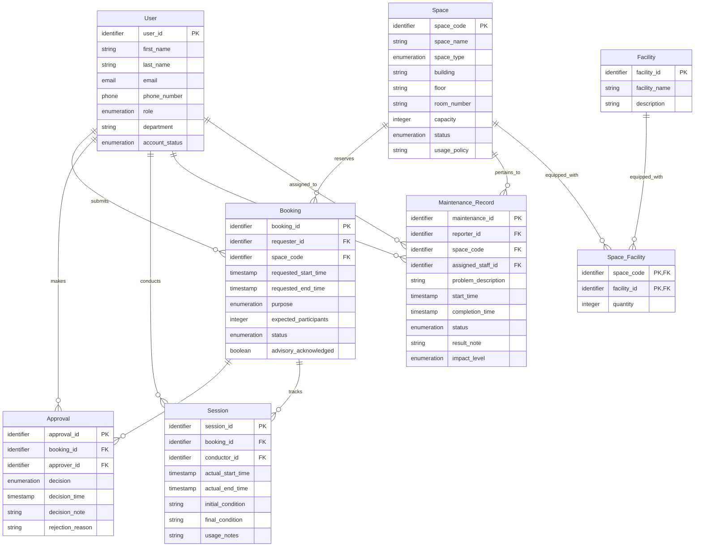

# Updated ERD and Logical Database Design

Baseline: `outputs/02-erd-design-G7.md` and `outputs/03-logical-design-G7.md` (Phase 1)
Change source: `outputs/08-req-change-analysis-G7.md` (Phase 2, RC-01 to RC-08)

This document presents the Phase 2 updated conceptual ERD and relational schema. It preserves the Phase 1 design wherever the requirements did not change it. Every change is annotated with its source requirement change (RC-xx) and the affected business rules.

---

## 1. Change Overview

| # | Design Element | Change Type | Source | Description |
| - | -------------- | ----------- | ------ | ----------- |
| C-01 | Maintenance Record entity / Maintenance_Record relation | Attribute added | RC-01, RC-04 | New attribute `impact_level` (out-of-service / advisory). |
| C-02 | Booking entity / Booking relation | Attribute added | RC-02 | New attribute `advisory_acknowledgement` recording that the requester was informed of all active advisories at booking time. |
| C-03 | pertains_to (Maintenance Record → Space) | Semantics modified | RC-01, RC-03 | A space may now have several simultaneously active maintenance records with different impact levels. Structure unchanged (still 1:N, FK on N-side). |
| C-04 | reserves (Booking → Space) | Semantics modified | RC-02, RC-07 | Booking a space with only advisory maintenance is permitted when the requester is notified and acknowledges; out-of-service maintenance blocks overlapping bookings. Structure unchanged. |
| C-05 | Cross-relation constraints | Modified / added / removed | RC-01..RC-07 | BR-19 removed; BR-32/BR-33 replaced by BR-44; BR-42, BR-44, BR-45, BR-46, BR-47 added as logical constraints; BR-14 retained (strengthened by BR-50 at concurrency level). |
| C-06 | No new entities or relationships | — | RC-01..RC-08 | All changes operate on existing entities (Maintenance Record, Booking, Space). Instant booking (RC-06) and reporting (RC-08) require no schema change (see Section 6.4). |

---

## 2. Updated Conceptual ERD

### 2.1 Entity Definitions (unchanged)

| Entity | Type | Description |
| ------ | ---- | ----------- |
| User | Strong | A person who interacts with the system. Users have university accounts and can act in various roles (student, lecturer, teaching assistant, facility staff, department administrator, facility manager). |
| Space | Strong | A bookable physical location on campus managed by the School of Computer Science. |
| Facility | Strong | Equipment or amenities available in a space (projector, whiteboard, microphone, computer, livestreaming equipment, air conditioner, etc.). |
| Booking | Strong | A request submitted by a user to reserve a space for a specific time period and purpose. |
| Approval | Strong | A decision made by facility staff or manager to approve or reject a booking request. Existence depends on Booking. |
| Session | Strong | The actual usage of a space corresponding to a booking. Captures what happened in reality versus what was requested. Existence depends on Booking. |
| Maintenance Record | Strong | A record of a maintenance issue reported for a space, tracking the problem through resolution. |

No entity is added or removed by the Phase 2 requirements.

### 2.2 Attributes (updated)

#### Entity: Booking — NEW attribute (RC-02)

| Attribute | Classification | Subattributes | Justification |
| --------- | -------------- | ------------- | ------------- |
| advisory_acknowledgement | Simple | — | Records that the requester was informed of all active advisories on the space at booking time and acknowledged them (BR-46). Atomic value. |

The remaining Booking attributes (booking_id, requested_start_time, requested_end_time, purpose, expected_participants, status) are unchanged from Phase 1.

#### Entity: Maintenance Record — NEW attribute (RC-01, RC-04)

| Attribute | Classification | Subattributes | Justification |
| --------- | -------------- | ------------- | ------------- |
| impact_level | Simple | — | Severity of the maintenance with respect to space usability: out-of-service (space unusable; booking blocked for overlapping periods) or advisory (space usable; notification required). Atomic enumeration value; may change while the record is open (BR-47). |

The remaining Maintenance Record attributes (maintenance_id, problem_description, start_time, completion_time, status, result_note) are unchanged from Phase 1.

#### All other entities

User, Space, Facility, Approval, Session attributes are unchanged from Phase 1.

### 2.3 Relationships (updated semantics, unchanged structure)

| Relationship | Degree | Relationship Attributes | Source Entity | Target Entity | Description |
| ------------ | ------ | ---------------------- | ------------- | ------------- | ----------- |
| submits | Binary | — | User | Booking | A user (requester) creates a booking request to reserve a space |
| reserves | Binary | — | Booking | Space | **MODIFIED (RC-02, RC-07):** A booking reserves a space; permitted for spaces with active advisory maintenance when the requester is notified and acknowledges (BR-45); not permitted for periods overlapping active out-of-service maintenance (BR-44). Validity must hold under concurrent booking and approval operations (BR-50). |
| makes | Binary | — | User | Approval | A facility staff member or manager makes an approval decision on a booking request |
| reviews | Binary | — | Approval | Booking | An approval decision reviews and determines the outcome of a specific booking request |
| conducts | Binary | — | User | Session | Facility staff conduct a usage session by performing check-in and completion operations |
| tracks | Binary | — | Session | Booking | A session records the actual usage that corresponds to an approved booking |
| reports | Binary | — | User | Maintenance Record | A user reports a maintenance issue, creating a maintenance record for a space |
| pertains_to | Binary | — | Maintenance Record | Space | **MODIFIED (RC-01, RC-03):** A maintenance record describes an issue with a specific space; a space may now have several simultaneously active maintenance records with different impact levels (BR-43). |
| equipped_with | Binary | quantity | Space | Facility | A space is equipped with various facilities; a facility may be available in multiple spaces |
| assigned_to | Binary | — | User | Maintenance Record | A facility staff member is assigned to handle a specific maintenance record |

No relationship is added or removed.

### 2.4 Cardinality and Participation Summary (updated)

| Relationship | Source Cardinality | Source Participation | Target Cardinality | Target Participation |
| ------------ | ----------------- | ------------------- | ----------------- | -------------------- |
| submits | 1 | Partial | N | Total |
| reserves | N | Total | 1 | Partial |
| makes | 1 | Partial | N | Total |
| reviews | 1 | Total | 1 | Partial |
| conducts | 1 | Partial | N | Total |
| tracks | 1 | Total | 1 | Partial |
| reports | 1 | Partial | N | Total |
| pertains_to | N (unchanged; a space may now hold several **simultaneously active** records, RC-03) | Total | 1 | Partial |
| equipped_with | M | Partial | N | Partial |
| assigned_to | 1 | Partial | N | Total |

### 2.5 Updated Conceptual ERD Diagram

```mermaid
flowchart LR

%% =========================
%% Entities
%% =========================

E_User[User]
E_Space[Space]
E_Facility[Facility]
E_Booking[Booking]
E_Approval[Approval]
E_Session[Session]
E_MaintRec[Maintenance Record]

%% =========================
%% Attributes - User
%% =========================

A_U_id((<u>user_id</u>))
A_U_fullname((full_name))
A_U_fname((first_name))
A_U_lname((last_name))
A_U_email((email))
A_U_phone((phone_number))
A_U_role((role))
A_U_dept((department))
A_U_status((account_status))

%% =========================
%% Attributes - Space
%% =========================

A_S_code((<u>space_code</u>))
A_S_name((space_name))
A_S_type((space_type))
A_S_bldg((building))
A_S_floor((floor))
A_S_room((room_number))
A_S_cap((capacity))
A_S_stat((status))
A_S_policy((usage_policy))

%% =========================
%% Attributes - Facility
%% =========================

A_F_id((<u>facility_id</u>))
A_F_name((facility_name))
A_F_desc((description))

%% =========================
%% Attributes - Booking
%% =========================

A_B_id((<u>booking_id</u>))
A_B_start((requested_start_time))
A_B_end((requested_end_time))
A_B_purpose((purpose))
A_B_parts((expected_participants))
A_B_status((status))
A_B_ack((advisory_acknowledgement)) %% NEW - RC-02

%% =========================
%% Attributes - Approval
%% =========================

A_A_id((<u>approval_id</u>))
A_A_dec((decision))
A_A_time((decision_time))
A_A_note((decision_note))
A_A_reason((rejection_reason))

%% =========================
%% Attributes - Session
%% =========================

A_Sess_id((<u>session_id</u>))
A_Sess_start((actual_start_time))
A_Sess_end((actual_end_time))
A_Sess_init((initial_condition))
A_Sess_final((final_condition))
A_Sess_notes((usage_notes))

%% =========================
%% Attributes - Maintenance Record
%% =========================

A_M_id((<u>maintenance_id</u>))
A_M_problem((problem_description))
A_M_start((start_time))
A_M_comp((completion_time))
A_M_status((status))
A_M_note((result_note))
A_M_level((impact_level)) %% NEW - RC-01, RC-04

%% =========================
%% Relationships
%% =========================

R_submits{submits}
R_reserves{reserves}
R_makes{makes}
R_reviews{reviews}
R_conducts{conducts}
R_tracks{tracks}
R_reports{reports}
R_pertains{pertains_to}
R_equipped{equipped_with}
RA_quantity((quantity))
R_assigned{assigned_to}

%% =========================
%% Entity-Attribute Links - User
%% =========================

E_User --- A_U_id
E_User --- A_U_fullname
A_U_fullname --- A_U_fname
A_U_fullname --- A_U_lname
E_User --- A_U_email
E_User --- A_U_phone
E_User --- A_U_role
E_User --- A_U_dept
E_User --- A_U_status

%% =========================
%% Entity-Attribute Links - Space
%% =========================

E_Space --- A_S_code
E_Space --- A_S_name
E_Space --- A_S_type
E_Space --- A_S_bldg
E_Space --- A_S_floor
E_Space --- A_S_room
E_Space --- A_S_cap
E_Space --- A_S_stat
E_Space --- A_S_policy

%% =========================
%% Entity-Attribute Links - Facility
%% =========================

E_Facility --- A_F_id
E_Facility --- A_F_name
E_Facility --- A_F_desc

%% =========================
%% Entity-Attribute Links - Booking
%% =========================

E_Booking --- A_B_id
E_Booking --- A_B_start
E_Booking --- A_B_end
E_Booking --- A_B_purpose
E_Booking --- A_B_parts
E_Booking --- A_B_status
E_Booking --- A_B_ack

%% =========================
%% Entity-Attribute Links - Approval
%% =========================

E_Approval --- A_A_id
E_Approval --- A_A_dec
E_Approval --- A_A_time
E_Approval --- A_A_note
E_Approval --- A_A_reason

%% =========================
%% Entity-Attribute Links - Session
%% =========================

E_Session --- A_Sess_id
E_Session --- A_Sess_start
E_Session --- A_Sess_end
E_Session --- A_Sess_init
E_Session --- A_Sess_final
E_Session --- A_Sess_notes

%% =========================
%% Entity-Attribute Links - Maintenance Record
%% =========================

E_MaintRec --- A_M_id
E_MaintRec --- A_M_problem
E_MaintRec --- A_M_start
E_MaintRec --- A_M_comp
E_MaintRec --- A_M_status
E_MaintRec --- A_M_note
E_MaintRec --- A_M_level

%% =========================
%% Relationship Links
%% =========================

E_User -- "1" --- R_submits
R_submits -- "N" --- E_Booking

E_Booking -- "N" --- R_reserves
R_reserves -- "1" --- E_Space

E_User -- "1" --- R_makes
R_makes -- "N" --- E_Approval

E_Approval -- "1" --- R_reviews
R_reviews -- "1" --- E_Booking

E_User -- "1" --- R_conducts
R_conducts -- "N" --- E_Session

E_Session -- "1" --- R_tracks
R_tracks -- "1" --- E_Booking

E_User -- "1" --- R_reports
R_reports -- "N" --- E_MaintRec

E_MaintRec -- "N" --- R_pertains
R_pertains -- "1" --- E_Space

E_Space -- "M" --- R_equipped
R_equipped -- "N" --- E_Facility
R_equipped --- RA_quantity

E_User -- "1" --- R_assigned
R_assigned -- "N" --- E_MaintRec
```

### 2.6 ERD Validation (updated)

#### Entity Coverage

* [X] Every accepted entity appears in the ERD.
* [X] No rejected candidate appears as an entity.
* [X] No new entity introduced (RC-01..RC-08 operate on existing entities only).

#### Attribute Coverage

* [X] `impact_level` (RC-01, RC-04) appears on Maintenance Record.
* [X] `advisory_acknowledgement` (RC-02) appears on Booking.
* [X] All Phase 1 attributes retained.

#### Relationship Coverage

* [X] Every relationship appears in the ERD (structure unchanged).
* [X] Every relationship includes cardinality information.
* [X] Semantics of `pertains_to` (RC-03) and `reserves` (RC-02, RC-07) updated and documented.

#### Participation Coverage

* [X] Participation constraints documented for all relationships.

#### Conceptual Modeling Compliance

* [X] No primary keys shown.
* [X] No foreign keys shown.
* [X] No junction tables shown.
* [X] No SQL concepts shown.
* [X] Chen notation semantics preserved.

#### Diagram Validation

* [X] Mermaid syntax is valid.
* [X] Mermaid Flowchart notation is used.
* [X] Mermaid ERD notation is not used.

### 2.7 Updated Assumptions (ERD level)

| ID | Assumption |
| -- | ---------- |
| ERD-A01 | All entities remain Strong with independent identity (unchanged). |
| ERD-A02 | User.full_name remains Composite with first_name / last_name subattributes (unchanged). |
| ERD-A03 | All relationships remain Non-identifying (unchanged). |
| ERD-A04 | No Derived attributes in the model (unchanged). |
| ERD-A05 | No Multivalued attributes in the model (unchanged). |
| ERD-A06 | `quantity` remains the only relationship attribute (unchanged). |
| ERD-A07 | Cardinality labels use simplified Chen notation (unchanged). |
| ERD-A08 | **NEW:** The impact level is an attribute of the Maintenance Record entity, not a separate entity — it describes a property of each maintenance record and does not require independent storage or lifecycle. |
| ERD-A09 | **NEW:** The advisory acknowledgement is a simple attribute of Booking; its exact capture mechanism is a later-stage concern (A-03, Q-02 in `08-req-change-analysis-G7.md`). |
| ERD-A10 | **NEW:** No new relationship is introduced for the advisory notification obligation — the relationship between Booking and Maintenance Record is derived at query time via the space and time period (A-06, Q-05 in `08-req-change-analysis-G7.md`). |

---

## 3. Updated Logical Database Design

### 3.1 Mapping Inventory (updated)

#### Entities

| Entity | Type | Identifier |
|--------|------|------------|
| User | Strong | user_id |
| Space | Strong | space_code |
| Facility | Strong | facility_id |
| Booking | Strong | booking_id |
| Approval | Strong | approval_id |
| Session | Strong | session_id |
| Maintenance Record | Strong | maintenance_id |

#### Relationships

| Relationship | Cardinality | Attributes | Change |
|--------------|-------------|------------|--------|
| submits | 1:N | - | unchanged |
| reserves | N:1 | - | semantics modified (RC-02, RC-07) |
| makes | 1:N | - | unchanged |
| reviews | 1:1 | - | unchanged |
| conducts | 1:N | - | unchanged |
| tracks | 1:1 | - | unchanged |
| reports | 1:N | - | unchanged |
| pertains_to | N:1 | - | semantics modified (RC-01, RC-03) |
| equipped_with | M:N | quantity | unchanged |
| assigned_to | 1:N | - | unchanged |

#### Special Constructs

* Weak entities: None (unchanged).
* Multivalued attributes: None (unchanged).
* Composite attributes: User.full_name → first_name, last_name (unchanged).
* Recursive relationships: None (unchanged).
* Specialization structures: None (unchanged).

### 3.2 Entity Mapping (unchanged)

| Entity | Relation | PK | Candidate Keys |
|--------|----------|----|----------------|
| User | User | user_id | email |
| Space | Space | space_code | (building, floor, room_number) |
| Facility | Facility | facility_id | facility_name |
| Booking | Booking | booking_id | - |
| Approval | Approval | approval_id | - |
| Session | Session | session_id | - |
| Maintenance Record | Maintenance_Record | maintenance_id | - |

No mapping decisions change: all entities remain strong, `full_name` stays decomposed, no derived attributes are stored.

### 3.3 Attribute Catalog (updated)

New rows are marked **NEW**; all other rows are unchanged from Phase 1.

| Relation | Attribute | Logical Domain | Nullable | Allowed Values / Range | Default | Notes |
|----------|-----------|----------------|----------|------------------------|---------|------|
| Booking | advisory_acknowledged | Boolean | Conditional | true, false | — | **NEW (RC-02, BR-46).** Required when the space has at least one active advisory maintenance record overlapping the requested period at booking time (BR-45); NULL when no advisory was active at booking time. Records that the requester was informed of all active advisories. |
| Maintenance_Record | impact_level | Enumeration | No | out_of_service, advisory | — | **NEW (RC-01, BR-42).** Severity with respect to space usability. Every maintenance record has exactly one impact level; may be escalated or downgraded while the record is open (RC-04, BR-47). |

Note: `Booking.advisory_acknowledged` is nullable in the schema to allow bookings made when no advisories were active; its conditional requirement is enforced by the implementation layer per BR-45/BR-46. `Maintenance_Record.impact_level` is NOT NULL per BR-42.

### 3.4 Relationship Mapping (unchanged structure)

All relationship mapping strategies from Phase 1 are retained unchanged:

* 1:1 `reviews` and `tracks`: FK with UNIQUE constraint on the total-participation side (Booking side).
* 1:N relationships: FK on the N-side relation (unchanged placement).
* M:N `equipped_with`: Space_Facility associative relation (unchanged).

The semantic changes of RC-02, RC-03, RC-07 affect constraint enforcement, not FK placement; they are captured in Section 3.7.

### 3.5 Foreign Key Analysis (unchanged)

| Relation | Foreign Key | References | Change |
|----------|------------|------------|--------|
| Booking | requester_id | User(user_id) | unchanged |
| Booking | space_code | Space(space_code) | unchanged |
| Approval | booking_id (UNIQUE) | Booking(booking_id) | unchanged |
| Approval | approver_id | User(user_id) | unchanged |
| Session | booking_id (UNIQUE) | Booking(booking_id) | unchanged |
| Session | conductor_id | User(user_id) | unchanged |
| Maintenance_Record | reporter_id | User(user_id) | unchanged |
| Maintenance_Record | space_code | Space(space_code) | unchanged |
| Maintenance_Record | assigned_staff_id | User(user_id) | unchanged |
| Space_Facility | space_code | Space(space_code) | unchanged |
| Space_Facility | facility_id | Facility(facility_id) | unchanged |

### 3.6 Candidate Key Analysis (unchanged)

| Relation | Candidate Key | Justification |
|----------|--------------|---------------|
| User | email | University email must be unique per user (BR-01). |
| Space | (building, floor, room_number) | Physical location combination must uniquely identify a space. |
| Facility | facility_name | Facility names are unique descriptors of equipment types. |

### 3.7 Integrity Constraint Analysis (updated)

#### Entity Integrity (unchanged)

Every relation keeps its NOT NULL, UNIQUE primary key: User(user_id), Space(space_code), Facility(facility_id), Booking(booking_id), Approval(approval_id), Session(session_id), Maintenance_Record(maintenance_id), Space_Facility(space_code, facility_id).

#### Referential Integrity (unchanged)

All 11 FK constraints from Phase 1 are retained unchanged.

#### Business Key Constraints (unchanged)

User.email, Space(building, floor, room_number), Facility.facility_name — UNIQUE constraints retained.

#### Cross-Relation Business Constraints (updated)

| ID | Constraint | Change | Enforcement Note |
|----|-----------|--------|------------------|
| BR-13 | A session may only exist for a booking with status approved. | Unchanged | Cross-relation (Session ↔ Booking.status); verified when a session is created. |
| BR-14 | The same space cannot have two approved bookings with overlapping time periods. | **Modified (RC-07)** — applies to both instant and staff-approved bookings, and must hold under concurrent operations (BR-50). | Temporal range-overlap check on (space_code, requested_start_time, requested_end_time) at booking submission and approval; concurrency enforcement is a Phase 2 implementation-stage concern. |
| BR-19 | A space should not have overlapping active (reported/in_progress) maintenance records. | **Removed (RC-03)** — superseded by BR-43; no overlap constraint remains on active maintenance records. | Removed from the constraint set. |
| BR-28 | An approved booking requires an associated approval record with decision approved. | Unchanged | Cross-relation (Booking ↔ Approval). Instant bookings (RC-06) obtain this approval record automatically at submission (BR-49) — an implementation-stage behavior, no schema change. |
| BR-29 | A rejected booking requires an associated approval record with decision rejected and a rejection reason. | Unchanged | rejection_reason conditional nullability retained. |
| BR-32 | A space with status under_maintenance, temporarily_closed, or retired cannot be booked. | **Modified (RC-01, RC-02)** — the blanket maintenance-blocking behavior is replaced by BR-44/BR-45; status-based blocking for temporarily_closed / retired is retained. | Checked at booking submission. |
| BR-33 | A maintenance record with status reported or in_progress prevents the related space from being booked. | **Modified (RC-01, RC-02)** — replaced by impact-level-based blocking (BR-44, BR-45). | Checked at booking submission. |
| BR-40 | Expected participants must not exceed the reserved space capacity. | Unchanged | Verified at booking submission. |
| BR-42 | Each maintenance record has an impact level: out_of_service or advisory. | **NEW (RC-01)** | Declarative: NOT NULL + CHECK (impact_level IN ('out_of_service','advisory')). |
| BR-44 | A space with an active out-of-service maintenance record cannot be booked for any time period overlapping the maintenance period. | **NEW (RC-01)** | Cross-relation temporal constraint (Booking ↔ Maintenance_Record.space_code, impact_level, start_time, completion_time); range-overlap check against open out-of-service records at booking submission. |
| BR-45 | A space with only active advisory maintenance records may be booked; the requester must be notified of all active advisories at booking time. | **NEW (RC-02)** | Implementation-layer obligation tied to the booking transaction; no declarative constraint. |
| BR-46 | The booking must record the requester's acknowledgement that they were informed of the active advisories. | **NEW (RC-02)** | Implementation-layer check: advisory_acknowledged must be present and true when advisories are active (conditional nullability in Section 3.3). |
| BR-47 | The impact level of an open maintenance record may be escalated (advisory → out-of-service) or downgraded. | **NEW (RC-04)** | Lifecycle constraint on Maintenance_Record.impact_level while status is reported/in_progress; single consistent current value (CC-05) is a Phase 2 concurrency concern. |
| BR-48 | When advisory maintenance is escalated to out-of-service, all approved bookings overlapping the maintenance period must be identifiable. | **NEW (RC-05)** | Derived query over Booking, Space, Maintenance_Record; satisfiable with the updated schema (space_code + times + impact_level) — no new storage required (A-05). |
| BR-49 | For selected space types, booking requests satisfying the usage policy are approved automatically at submission time. | **NEW (RC-06)** | Process rule; uses existing Booking.status and Approval relations. Exact eligibility is open (Q-01, A-02) and belongs to the implementation stage. |
| BR-50 | The no-overlapping-approved-bookings rule (BR-14) must hold regardless of booking path and concurrent operations. | **NEW (RC-07)** | Concurrency invariant; enforcement mechanism (transactions, isolation levels, locking) is a Phase 2 implementation-stage concern, not a schema change. |

---

## 4. Updated Relational Schema Diagram



---

## 5. Mapping Completeness Verification (updated)

| Criterion | Status |
|-----------|--------|
| Every entity mapped to a relation | ✓ All 7 entities mapped (all strong) |
| Every attribute mapped | ✓ All Phase 1 attributes plus new `impact_level` (RC-01) and `advisory_acknowledged` (RC-02) |
| Every attribute has an identified logical domain | ✓ Attribute catalog (Section 3.3) covers all 57 attributes across 8 relations |
| Enumerated domains documented | ✓ impact_level values out_of_service, advisory documented (BR-42) |
| Value ranges documented | ✓ capacity >= 1; expected_participants >= 1; quantity >= 1; temporal ordering rules retained |
| Nullable attributes identified | ✓ advisory_acknowledged conditional nullability documented (BR-45/BR-46) |
| Every identifier preserved | ✓ All PKs defined; unchanged |
| Every relationship represented | ✓ All 10 relationships represented; 2 with updated semantics |
| 1:1 relationships mapped correctly | ✓ reviews and tracks via FK + UNIQUE (unchanged) |
| 1:N relationships mapped correctly | ✓ All 1:N relationships via FK on N-side (unchanged) |
| M:N relationships mapped correctly | ✓ equipped_with via Space_Facility (unchanged) |
| N-ary relationships mapped correctly | ✓ None identified |
| Composite attributes decomposed | ✓ full_name decomposed (unchanged) |
| Multivalued attributes resolved | ✓ None identified |
| Weak entities mapped correctly | ✓ None identified |
| Recursive relationships mapped | ✓ None identified |
| Relationship attributes preserved | ✓ quantity preserved (unchanged) |
| Foreign keys identified | ✓ All 11 FK references documented (unchanged) |
| Candidate keys documented | ✓ 3 candidate keys (unchanged) |
| Referential integrity represented | ✓ All FK constraints documented (unchanged) |
| Cross-relation business constraints documented | ✓ Updated: BR-14 modified, BR-19 removed, BR-32/BR-33 modified, BR-42/BR-44/BR-45/BR-46/BR-47/BR-48/BR-49/BR-50 added |
| No implementation-specific details | ✓ No SQL, no DBMS-specific syntax; concurrency and notification mechanisms deferred to implementation stages |
| Logical schema internally consistent | ✓ All references verified; traceability to RC-01..RC-08 maintained |

---

## 6. Rationale for Design Changes

### 6.1 Maintenance Record impact_level (C-01)

The requirement change RC-01 explicitly assigns each maintenance record an impact level; RC-04 makes the level mutable while the record is open. The level is an intrinsic property of each maintenance record, so it is modeled as a simple enumeration attribute of the existing entity (ERD-A08) rather than a new entity — it has no independent identity or lifecycle and its values (out_of_service, advisory) are fixed (A-01). It is NOT NULL because BR-42 requires every record to have a level. BR-47 (escalation/downgrade) requires no extra schema — it only constrains value changes over the record's lifecycle.

### 6.2 Booking advisory acknowledgement (C-02)

RC-02 requires the booking to carry the requester's acknowledgement of the active advisories. It is a property of the booking itself, so it is a simple boolean attribute of Booking (ERD-A09). It is conditionally nullable: when no advisory is active at booking time there is nothing to acknowledge (BR-45), but when advisories are active the field must be present and true (BR-46). The notification mechanism itself (A-06) and the acknowledgement capture process (Q-02) are outside this stage.

### 6.3 Changed relationship semantics (C-03, C-04)

Both changed relationships keep their Phase 1 structure — `pertains_to` remains 1:N with the FK in Maintenance_Record, and `reserves` remains N:1 with the FK in Booking — because RC-03 and RC-02 alter the *business rules* governing record multiplicity and booking eligibility, not the cardinalities or identity of the participating entities. Multiple active maintenance records per space (BR-43) require only the removal of the BR-19 overlap constraint; no new table or join is introduced.

### 6.4 Changes requiring no schema modification

| Requirement Change | Why no schema change |
| ------------------ | -------------------- |
| RC-05 (identify affected approved bookings) | Derived query over existing relations plus new impact_level (A-05). |
| RC-06 (instant booking) | Process rule over existing Booking.status and Approval relations (A-02, Q-01). |
| RC-07 / BR-50 (concurrency invariant) | Enforced by transactions/isolation at the implementation stage, not by schema. |
| RC-08 (reporting) | All reports derive from existing history (A-05). |

---

## 7. Traceability Summary

| Design Element | Requirement Change | Business Rule | Phase 1 Artifact Location |
| -------------- | ------------------ | ------------- | ------------------------- |
| Maintenance_Record.impact_level | RC-01, RC-04 | BR-42, BR-47 | 03-logical-design §3 (new) |
| Booking.advisory_acknowledged | RC-02 | BR-45, BR-46 | 03-logical-design §3 (new) |
| pertains_to semantics | RC-01, RC-03 | BR-43, BR-19 (removed) | 02-erd-design §3-4; 03-logical-design §4 |
| reserves semantics | RC-02, RC-07 | BR-14, BR-44, BR-45, BR-50 | 02-erd-design §3-4; 03-logical-design §4 |
| Booking availability constraints | RC-01, RC-02 | BR-32, BR-33 (modified), BR-44 | 03-logical-design §8 |
| Escalation reporting | RC-05 | BR-48 | derived query (no schema) |
| Instant booking | RC-06 | BR-49 | process rule (no schema) |
| No-conflict invariant | RC-07 | BR-14 (modified), BR-50 | concurrency stage (no schema) |
| New reports | RC-08 | — | derived queries (no schema) |

---

## 8. Assumptions and Open Questions (updated)

### Assumptions

| ID | Assumption |
| -- | ---------- |
| LD-01..LD-08 | All Phase 1 logical-design assumptions retained unchanged (role-name FKs, no artificial keys, Space_Facility PK, strong Approval/Session, floor string, inferred defaults, conditional nullability, cross-relation constraints). |
| ULD-01 | The two impact levels (out_of_service, advisory) are exhaustive (A-01 in `08-req-change-analysis-G7.md`). |
| ULD-02 | `advisory_acknowledged` is conditionally nullable rather than always required, because bookings may be created when no advisory is active (BR-45); when advisories are active it must be true (BR-46). |
| ULD-03 | Instant booking eligibility (selected space types, usage policy) is unresolved and therefore not encoded in the schema (A-02, Q-01); it is an implementation-stage decision. |
| ULD-04 | Escalation/downgrade applies only while the maintenance record is open (A-04); once completed the impact level is fixed as the last recorded value. |
| ULD-05 | No upper bound is placed on the number of simultaneously active maintenance records per space (Q-06); BR-43 permits any number. |

### Open Questions (carried from `08-req-change-analysis-G7.md`)

| ID | Question |
| -- | -------- |
| Q-01 | Which space types are eligible for instant booking, and what does "satisfy the usage policy" require? |
| Q-02 | How is the requester's acknowledgement confirmed? |
| Q-03 | Can impact level be downgraded below advisory? |
| Q-04 | May affected approved bookings be cancelled after escalation, or only contacted? |
| Q-05 | What counts as "at booking time" for advisory notification? |
| Q-06 | Is there a maximum number of simultaneous active maintenance records per space? |

These questions do not block the updated design; they constrain implementation-stage decisions (migration script, concurrency mechanisms, analytical queries).
