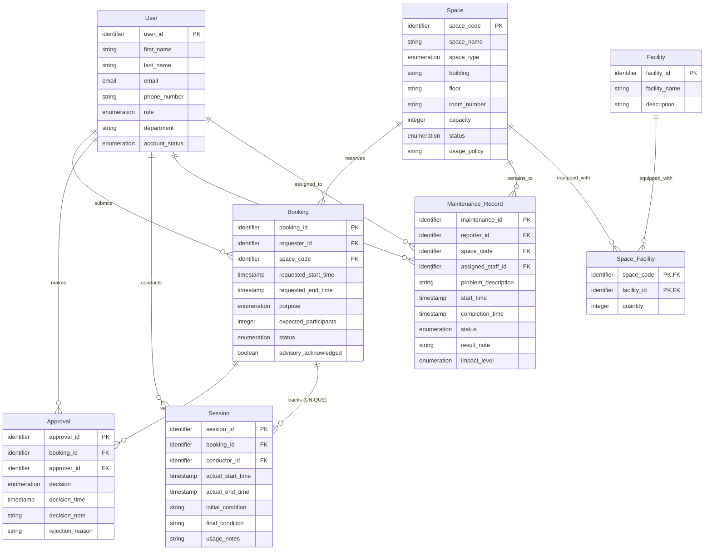

# Updated ERD and Logical Design

Baseline: `outputs/02-erd-design-G7.md` and `outputs/03-logical-design-G7.md` (Phase 1)
Change source: `outputs/08-req-change-analysis-G7.md` (Phase 2, RC-01 to RC-08)

This document presents the Phase 2 updated conceptual ERD and relational schema. It preserves the Phase 1 design wherever the requirements did not change it. All changes operate on the existing entities Maintenance Record, Booking, and Space; no new entity or relationship is introduced. Every change is annotated with its source requirement change (RC-xx) and the affected business rules.

---

# 1. Design Change Summary

| Design Element | Action | Related Requirement | Description |
| -------------- | ------ | ------------------- | ----------- |
| Maintenance Record entity / Maintenance_Record relation — attribute `impact_level` | Added | RC-01, RC-04 | New attribute recording the severity of the maintenance with respect to space usability: `out_of_service` (space unusable; booking blocked for overlapping periods) or `advisory` (space usable; notification required). The level may be escalated or downgraded while the record is open (BR-47). |
| Booking entity / Booking relation — attribute `advisory_acknowledged` | Added | RC-02 | New attribute recording that the requester was informed of all active advisories on the space at booking time and acknowledged them (BR-46). Conditionally nullable: present and true only when advisories were active at booking time (BR-45). |
| `pertains_to` (Maintenance Record → Space) relationship semantics | Modified | RC-01, RC-03 | A space may now have several simultaneously active maintenance records with different impact levels (BR-43). Structure unchanged: still 1:N with the FK on the N-side. |
| `reserves` (Booking → Space) relationship semantics | Modified | RC-02, RC-07 | Booking a space with only active advisory maintenance is permitted when the requester is notified and acknowledges; booking is blocked only for periods overlapping active out-of-service maintenance. Structure unchanged (N:1, FK on the N-side). |
| Cross-relation business constraint set | Modified / Added / Removed | RC-01..RC-07 | BR-19 removed (RC-03); BR-32 / BR-33 modified (replaced by impact-level-based behavior); BR-42, BR-44, BR-45, BR-46, BR-47 added; BR-14 modified and strengthened by BR-50 (concurrency invariant). |
| New entities and new relationships | No Change | RC-01..RC-08 | All changes operate on existing entities. Instant booking (RC-06), escalation reporting (RC-05), the concurrency invariant (RC-07), and reporting (RC-08) require no schema change (see Section 2: DD-03, DD-04, DD-05). |

---

# 2. Design Decisions

| ID | Design Decision | Alternatives Considered | Rationale |
| -- | --------------- | ----------------------- | --------- |
| DD-01 | `impact_level` is modeled as a simple enumeration attribute of Maintenance Record, not as a separate entity. | (a) A new lookup entity for impact levels; (b) a new weak entity; (c) a simple attribute on the existing entity. | The level is an intrinsic property of each maintenance record; it has no independent identity or lifecycle, and its allowed values are exhaustive (A-01: exactly `out_of_service` and `advisory`). A separate entity would introduce storage for a fixed two-value set with no modeling benefit. The requirement change analysis explicitly notes that no new entity is required. |
| DD-02 | `advisory_acknowledged` is a single conditionally-nullable boolean attribute of Booking. | (a) Mandatory boolean always set; (b) a separate acknowledgement entity recording per-advisory acknowledgements; (c) a conditionally-nullable boolean subject to BR-46. | When no advisory is active at booking time there is nothing to acknowledge, so a mandatory field would reject valid bookings (BR-45). The requirement states the acknowledgement is "stored with the booking" (A-03) as one aggregate value, so a per-advisory acknowledgement entity is not required; Q-02 concerns how the acknowledgement is captured, not how it is stored. |
| DD-03 | The advisory notification obligation (BR-45) is not modeled as a new relationship between Booking and Maintenance Record. | (a) An explicit M:N relationship between Booking and Maintenance Record; (b) derive the advisory set at query time via space + time period. | The set of active advisories affecting a booking is fully determined from existing data (booking's space, requested time period, the space's advisory maintenance records). Materializing it would create redundant storage; the captured business fact is only the boolean acknowledgement (DD-02). ERD assumption ERD-A10 records this decision. |
| DD-04 | Instant booking (RC-06) is modeled as a process rule, not as schema. | (a) A booking approval-path/source column in Booking; (b) a dedicated instant-booking relation; (c) a process rule using existing Booking.status and Approval. | Eligibility is explicitly unresolved (A-02, Q-01: which space types and what the usage policy requires). Adding schema now would be speculative; the outcome — status = approved at submission plus an Approval record — is fully expressible with the existing relations (BR-49). |
| DD-05 | The no-conflict rule (BR-14 / BR-50) is kept as a cross-relation temporal constraint, enforced at the implementation layer. | (a) A declarative UNIQUE constraint; (b) an application-level invariant enforced under concurrency control. | A range-overlap conflict on `(space_code, requested_start_time, requested_end_time)` cannot be expressed as a declarative UNIQUE (equality) constraint. The enforcement mechanism (transactions, isolation levels, locking) is a Phase 2 implementation-stage concern (Stage 11–12) and is out of scope for this stage. |
| DD-06 | No impact-level-change history is stored. | (a) A `Maintenance_Level_History` relation recording escalation/downgrade events; (b) keep only a single current column. | RC-04 requires the capability to escalate/downgrade and CC-05 requires one consistent current value; it does not require auditing the change history, and none of the RC-08 reports consume level-change history. A history relation would be added only if a future requirement demands an audit trail. |

---

# 3. Updated Conceptual Design

## Conceptual Design Changes

| Element | Action | Description |
| ------- | ------ | ----------- |
| Maintenance Record entity | Modified | Attribute `impact_level` (out-of-service / advisory) added (RC-01, RC-04). Entity identity and strength unchanged. |
| Booking entity | Modified | Attribute `advisory_acknowledgement` added (RC-02). |
| Space entity | No Change | Booking-eligibility semantics change (RC-01, RC-02) but no attribute or structure change. |
| `pertains_to` relationship | Modified | A space may now host several simultaneously active maintenance records with different impact levels (RC-03, BR-43). Cardinality and participation unchanged. |
| `reserves` relationship | Modified | Permits bookings on advisory-maintained spaces with notification + acknowledgement; blocks only periods overlapping out-of-service maintenance (RC-02, RC-07). Cardinality and participation unchanged. |
| All other entities / relationships | No Change | User, Facility, Approval, Session; submits, makes, reviews, conducts, tracks, reports, equipped_with, assigned_to unchanged. |
| New entities / new relationships | None | The requirement change analysis (Section 3 of `08-req-change-analysis-G7.md`) identifies no new entity; the notification obligation is realized as a Booking attribute (DD-02) and a derived advisory set (DD-03). |

### Updated Conceptual ERD

```mermaid
flowchart LR

%% =========================
%% Entities
%% =========================

E_User[User]
E_Space[Space]
E_Facility[Facility]
E_Booking[Booking]
E_Approval[Approval]
E_Session[Session]
E_MaintRec[Maintenance Record]

%% =========================
%% Attributes - User
%% =========================

A_U_id((<u>user_id</u>))
A_U_fullname((full_name))
A_U_fname((first_name))
A_U_lname((last_name))
A_U_email((email))
A_U_phone((phone_number))
A_U_role((role))
A_U_dept((department))
A_U_status((account_status))

%% =========================
%% Attributes - Space
%% =========================

A_S_code((<u>space_code</u>))
A_S_name((space_name))
A_S_type((space_type))
A_S_bldg((building))
A_S_floor((floor))
A_S_room((room_number))
A_S_cap((capacity))
A_S_stat((status))
A_S_policy((usage_policy))

%% =========================
%% Attributes - Facility
%% =========================

A_F_id((<u>facility_id</u>))
A_F_name((facility_name))
A_F_desc((description))

%% =========================
%% Attributes - Booking
%% =========================

A_B_id((<u>booking_id</u>))
A_B_start((requested_start_time))
A_B_end((requested_end_time))
A_B_purpose((purpose))
A_B_parts((expected_participants))
A_B_status((status))
%% NEW - RC-02
A_B_ack((advisory_acknowledgement))

%% =========================
%% Attributes - Approval
%% =========================

A_A_id((<u>approval_id</u>))
A_A_dec((decision))
A_A_time((decision_time))
A_A_note((decision_note))
A_A_reason((rejection_reason))

%% =========================
%% Attributes - Session
%% =========================

A_Sess_id((<u>session_id</u>))
A_Sess_start((actual_start_time))
A_Sess_end((actual_end_time))
A_Sess_init((initial_condition))
A_Sess_final((final_condition))
A_Sess_notes((usage_notes))

%% =========================
%% Attributes - Maintenance Record
%% =========================

A_M_id((<u>maintenance_id</u>))
A_M_problem((problem_description))
A_M_start((start_time))
A_M_comp((completion_time))
A_M_status((status))
A_M_note((result_note))
%% NEW - RC-01, RC-04
A_M_level((impact_level))

%% =========================
%% Relationships
%% =========================

R_submits{submits}
R_reserves{reserves}
R_makes{makes}
R_reviews{reviews}
R_conducts{conducts}
R_tracks{tracks}
R_reports{reports}
R_pertains{pertains_to}
R_equipped{equipped_with}
RA_quantity((quantity))
R_assigned{assigned_to}

%% =========================
%% Entity-Attribute Links - User
%% =========================

E_User --- A_U_id
E_User --- A_U_fullname
A_U_fullname --- A_U_fname
A_U_fullname --- A_U_lname
E_User --- A_U_email
E_User --- A_U_phone
E_User --- A_U_role
E_User --- A_U_dept
E_User --- A_U_status

%% =========================
%% Entity-Attribute Links - Space
%% =========================

E_Space --- A_S_code
E_Space --- A_S_name
E_Space --- A_S_type
E_Space --- A_S_bldg
E_Space --- A_S_floor
E_Space --- A_S_room
E_Space --- A_S_cap
E_Space --- A_S_stat
E_Space --- A_S_policy

%% =========================
%% Entity-Attribute Links - Facility
%% =========================

E_Facility --- A_F_id
E_Facility --- A_F_name
E_Facility --- A_F_desc

%% =========================
%% Entity-Attribute Links - Booking
%% =========================

E_Booking --- A_B_id
E_Booking --- A_B_start
E_Booking --- A_B_end
E_Booking --- A_B_purpose
E_Booking --- A_B_parts
E_Booking --- A_B_status
E_Booking --- A_B_ack

%% =========================
%% Entity-Attribute Links - Approval
%% =========================

E_Approval --- A_A_id
E_Approval --- A_A_dec
E_Approval --- A_A_time
E_Approval --- A_A_note
E_Approval --- A_A_reason

%% =========================
%% Entity-Attribute Links - Session
%% =========================

E_Session --- A_Sess_id
E_Session --- A_Sess_start
E_Session --- A_Sess_end
E_Session --- A_Sess_init
E_Session --- A_Sess_final
E_Session --- A_Sess_notes

%% =========================
%% Entity-Attribute Links - Maintenance Record
%% =========================

E_MaintRec --- A_M_id
E_MaintRec --- A_M_problem
E_MaintRec --- A_M_start
E_MaintRec --- A_M_comp
E_MaintRec --- A_M_status
E_MaintRec --- A_M_note
E_MaintRec --- A_M_level

%% =========================
%% Relationship Links
%% =========================

E_User -- "1" --- R_submits
R_submits -- "N" --- E_Booking

E_Booking -- "N" --- R_reserves
R_reserves -- "1" --- E_Space

E_User -- "1" --- R_makes
R_makes -- "N" --- E_Approval

E_Approval -- "1" --- R_reviews
R_reviews -- "1" --- E_Booking

E_User -- "1" --- R_conducts
R_conducts -- "N" --- E_Session

E_Session -- "1" --- R_tracks
R_tracks -- "1" --- E_Booking

E_User -- "1" --- R_reports
R_reports -- "N" --- E_MaintRec

E_MaintRec -- "N" --- R_pertains
R_pertains -- "1" --- E_Space

E_Space -- "M" --- R_equipped
R_equipped -- "N" --- E_Facility
R_equipped --- RA_quantity

E_User -- "1" --- R_assigned
R_assigned -- "N" --- E_MaintRec
```



### ERD Validation (updated)

#### Entity Coverage

* [X] Every accepted entity appears in the ERD (7 entities, unchanged).
* [X] No rejected candidate appears as an entity.
* [X] No new entity introduced (RC-01..RC-08 operate on existing entities only).

#### Attribute Coverage

* [X] `impact_level` (RC-01, RC-04) appears on Maintenance Record.
* [X] `advisory_acknowledgement` (RC-02) appears on Booking.
* [X] All Phase 1 attributes retained.

#### Relationship Coverage

* [X] Every relationship appears in the ERD (10 relationships, structure unchanged).
* [X] Every relationship includes cardinality information.
* [X] Semantics of `pertains_to` (RC-03) and `reserves` (RC-02, RC-07) updated and documented.

#### Participation Coverage

* [X] Participation constraints documented for all relationships.

#### Conceptual Modeling Compliance

* [X] No primary keys shown (key attributes underlined in diagram are for identification only).
* [X] No foreign keys shown.
* [X] No junction tables shown.
* [X] No SQL concepts shown.
* [X] Chen notation semantics preserved.

#### Diagram Validation

* [X] Mermaid syntax is valid.
* [X] Mermaid Flowchart notation is used.
* [X] Mermaid ERD notation is not used.

---

# 4. Updated Logical Design

## Logical Design Changes

| Element | Action | Description |
| ------- | ------ | ----------- |
| Maintenance_Record relation | Modified | New attribute `impact_level` (Enumeration, values `out_of_service` / `advisory`, NOT NULL per BR-42). |
| Booking relation | Modified | New attribute `advisory_acknowledged` (Boolean, conditionally nullable per BR-45 / BR-46). |
| Primary / foreign / candidate keys | No Change | All Phase 1 PKs, FKs, and candidate keys retained unchanged (8 PKs, 11 FKs, 3 candidate keys). |
| Relationship mappings | No Change | `reviews` / `tracks` via FK + UNIQUE; 1:N via FK on N-side; `equipped_with` via Space_Facility associative relation. |
| Cross-relation constraint set | Modified | BR-14 modified (RC-07); BR-19 removed (RC-03); BR-32 / BR-33 modified (RC-01, RC-02); BR-42, BR-44, BR-45, BR-46, BR-47 added. |

### Updated Attribute Catalog (changed rows only)

All attributes except the two rows below are unchanged from the Phase 1 logical design (`outputs/03-logical-design-G7.md`, Section 3).

| Relation | Attribute | Logical Domain | Nullable | Allowed Values / Range | Default | Notes |
|----------|-----------|----------------|----------|------------------------|---------|------|
| Booking | advisory_acknowledged | Boolean | Conditional | true, false | — | NEW (RC-02, BR-46). Required (must be true) when the space has at least one active advisory maintenance record overlapping the requested period at booking time (BR-45); NULL when no advisory was active. Records that the requester was informed of all active advisories. |
| Maintenance_Record | impact_level | Enumeration | No | out_of_service, advisory | — | NEW (RC-01, BR-42). Severity with respect to space usability. Every maintenance record has exactly one impact level; may be escalated or downgraded while the record is open (RC-04, BR-47). |

### Updated Relational Schema

```
User(
    user_id,              -- PK
    first_name,
    last_name,
    email,                -- candidate key
    phone_number,
    role,
    department,
    account_status
)

Space(
    space_code,           -- PK
    space_name,
    space_type,
    building,
    floor,
    room_number,          -- candidate key: (building, floor, room_number)
    capacity,
    status,
    usage_policy
)

Facility(
    facility_id,          -- PK
    facility_name,        -- candidate key
    description
)

Booking(
    booking_id,           -- PK
    requester_id,         -- FK -> User(user_id)
    space_code,           -- FK -> Space(space_code)
    requested_start_time,
    requested_end_time,
    purpose,
    expected_participants,
    status,
    advisory_acknowledged -- NEW (RC-02); conditionally nullable
)

Approval(
    approval_id,          -- PK
    booking_id,           -- FK, UNIQUE -> Booking(booking_id)
    approver_id,          -- FK -> User(user_id)
    decision,
    decision_time,
    decision_note,
    rejection_reason
)

Session(
    session_id,           -- PK
    booking_id,           -- FK, UNIQUE -> Booking(booking_id)
    conductor_id,         -- FK -> User(user_id)
    actual_start_time,
    actual_end_time,
    initial_condition,
    final_condition,
    usage_notes
)

Maintenance_Record(
    maintenance_id,       -- PK
    reporter_id,          -- FK -> User(user_id)
    space_code,           -- FK -> Space(space_code)
    assigned_staff_id,    -- FK -> User(user_id)
    problem_description,
    start_time,
    completion_time,
    status,
    result_note,
    impact_level          -- NEW (RC-01); NOT NULL; enumeration
)

Space_Facility(
    space_code,           -- PK part, FK -> Space(space_code)
    facility_id,          -- PK part, FK -> Facility(facility_id)
    quantity
)
```

### Updated Logical Schema Diagram



### Foreign Key Analysis (unchanged)

All 11 FK references from Phase 1 are retained unchanged (`outputs/03-logical-design-G7.md`, Section 6): Booking(requester_id, space_code), Approval(booking_id UNIQUE, approver_id), Session(booking_id UNIQUE, conductor_id), Maintenance_Record(reporter_id, space_code, assigned_staff_id), Space_Facility(space_code, facility_id).

### Candidate Key Analysis (unchanged)

| Relation | Candidate Key | Justification |
|----------|--------------|---------------|
| User | email | University email must be unique per user (BR-01). |
| Space | (building, floor, room_number) | Physical location combination must uniquely identify a space. |
| Facility | facility_name | Facility names are unique descriptors of equipment types. |

### Integrity Constraint Analysis (updated)

#### Entity Integrity (unchanged)

Every relation keeps its NOT NULL, UNIQUE primary key: User(user_id), Space(space_code), Facility(facility_id), Booking(booking_id), Approval(approval_id), Session(session_id), Maintenance_Record(maintenance_id), Space_Facility(space_code, facility_id).

#### Referential Integrity (unchanged)

All 11 FK constraints from Phase 1 are retained unchanged.

#### Business Key Constraints (unchanged)

User.email, Space(building, floor, room_number), Facility.facility_name — UNIQUE constraints retained.

#### Cross-Relation Business Constraints (updated)

| ID | Constraint | Change | Enforcement Note |
|----|-----------|--------|------------------|
| BR-13 | A session may only exist for a booking with status approved. | Unchanged | Cross-relation (Session ↔ Booking.status); verified when a session is created. |
| BR-14 | The same space cannot have two approved bookings with overlapping time periods. | Modified (RC-07) — applies to both instant and staff-approved bookings and must hold under concurrent operations (BR-50). | Temporal range-overlap check on (space_code, requested_start_time, requested_end_time) at booking submission and approval; concurrency enforcement is an implementation-stage concern (DD-05). |
| BR-19 | A space should not have overlapping active (reported/in_progress) maintenance records. | Removed (RC-03) — superseded by BR-43; no overlap constraint remains on active maintenance records. | Removed from the constraint set. |
| BR-28 | An approved booking requires an associated approval record with decision approved. | Unchanged | Cross-relation (Booking ↔ Approval). Instant bookings (RC-06) obtain this approval record automatically at submission (BR-49) — an implementation-stage behavior; no schema change. |
| BR-29 | A rejected booking requires an associated approval record with decision rejected and a rejection reason. | Unchanged | rejection_reason conditional nullability retained. |
| BR-32 | A space with status under_maintenance, temporarily_closed, or retired cannot be booked. | Modified (RC-01, RC-02) — the blanket maintenance-blocking behavior is replaced by BR-44 / BR-45; status-based blocking for temporarily_closed / retired is retained. | Checked at booking submission. |
| BR-33 | A maintenance record with status reported or in_progress prevents the related space from being booked. | Modified (RC-01, RC-02) — replaced by impact-level-based blocking (BR-44, BR-45). | Checked at booking submission. |
| BR-40 | Expected participants must not exceed the reserved space capacity. | Unchanged | Verified at booking submission. |
| BR-42 | Each maintenance record has an impact level: out_of_service or advisory. | NEW (RC-01) | Declarative: NOT NULL + CHECK (impact_level IN ('out_of_service','advisory')). |
| BR-44 | A space with an active out-of-service maintenance record cannot be booked for any time period overlapping the maintenance period. | NEW (RC-01) | Cross-relation temporal constraint (Booking ↔ Maintenance_Record.space_code, impact_level, start_time, completion_time); range-overlap check against open out-of-service records at booking submission. |
| BR-45 | A space with only active advisory maintenance records may be booked; the requester must be notified of all active advisories at booking time. | NEW (RC-02) | Implementation-layer obligation tied to the booking transaction; no declarative constraint. |
| BR-46 | The booking must record the requester's acknowledgement that they were informed of the active advisories. | NEW (RC-02) | Implementation-layer check: advisory_acknowledged must be present and true when advisories are active (conditional nullability in the attribute catalog). |
| BR-47 | The impact level of an open maintenance record may be escalated (advisory → out-of-service) or downgraded. | NEW (RC-04) | Lifecycle constraint on Maintenance_Record.impact_level while status is reported/in_progress; single consistent current value (CC-05) is a Phase 2 concurrency concern. |
| BR-48 | When advisory maintenance is escalated to out-of-service, all approved bookings overlapping the maintenance period must be identifiable. | NEW (RC-05) | Derived query over Booking, Space, Maintenance_Record; satisfiable with the updated schema (space_code + times + impact_level) — no new storage required (A-05). |
| BR-49 | For selected space types, booking requests satisfying the usage policy are approved automatically at submission time. | NEW (RC-06) | Process rule; uses existing Booking.status and Approval relations. Exact eligibility is open (Q-01, A-02) and belongs to the implementation stage. |
| BR-50 | The no-overlapping-approved-bookings rule (BR-14) must hold regardless of booking path and concurrent operations. | NEW (RC-07) | Concurrency invariant; enforcement mechanism (transactions, isolation levels, locking) is a Phase 2 implementation-stage concern, not a schema change. |

---

# 5. Functional Dependency and Normalization Analysis

## 5.1 Functional Dependencies

For each relation: candidate key(s), primary key, and non-trivial functional dependencies.

### User

**Candidate Key(s):** user_id (PK), email

**Functional Dependencies**

- user_id → first_name, last_name, email, phone_number, role, department, account_status
- email → user_id (candidate key equivalence)

### Space

**Candidate Key(s):** space_code (PK), (building, floor, room_number)

**Functional Dependencies**

- space_code → space_name, space_type, building, floor, room_number, capacity, status, usage_policy
- (building, floor, room_number) → space_code

### Facility

**Candidate Key(s):** facility_id (PK), facility_name

**Functional Dependencies**

- facility_id → facility_name, description
- facility_name → facility_id

### Booking

**Candidate Key(s):** booking_id (PK)

**Functional Dependencies**

- booking_id → requester_id, space_code, requested_start_time, requested_end_time, purpose, expected_participants, status, advisory_acknowledged

### Approval

**Candidate Key(s):** approval_id (PK), booking_id (UNIQUE FK)

**Functional Dependencies**

- approval_id → booking_id, approver_id, decision, decision_time, decision_note, rejection_reason
- booking_id → approval_id, approver_id, decision, decision_time, decision_note, rejection_reason (booking_id is a candidate key)

### Session

**Candidate Key(s):** session_id (PK), booking_id (UNIQUE FK)

**Functional Dependencies**

- session_id → booking_id, conductor_id, actual_start_time, actual_end_time, initial_condition, final_condition, usage_notes
- booking_id → session_id, conductor_id, actual_start_time, actual_end_time, initial_condition, final_condition, usage_notes (booking_id is a candidate key)

### Maintenance_Record

**Candidate Key(s):** maintenance_id (PK)

**Functional Dependencies**

- maintenance_id → reporter_id, space_code, assigned_staff_id, problem_description, start_time, completion_time, status, result_note, impact_level

### Space_Facility

**Candidate Key(s):** (space_code, facility_id) (composite PK)

**Functional Dependencies**

- (space_code, facility_id) → quantity

## 5.2 Normal Form Verification

| Relation | Candidate Key(s) | Highest Normal Form | 3NF Status | Justification |
| -------- | ---------------- | ------------------- | ---------- | ------------- |
| User | user_id, email | 3NF | ✓ | All attributes atomic (1NF); single-attribute key so no partial-key dependency (2NF); email → user_id is a candidate-key dependency, not a transitive dependency over a non-key determinant (3NF). |
| Space | space_code; (building, floor, room_number) | 3NF | ✓ | All attributes atomic (1NF); no partial dependency: both candidate keys are either single-attribute or fully prime, and each non-key attribute depends on each key as a whole (2NF); the only inter-key dependency runs between candidate keys, so no transitive dependency exists (3NF). |
| Facility | facility_id, facility_name | 3NF | ✓ | All attributes atomic (1NF); single-attribute key (2NF); facility_name → facility_id is a candidate-key dependency (3NF). |
| Booking | booking_id | 3NF | ✓ | All attributes atomic (1NF); single-attribute key (2NF); every non-key attribute depends only on booking_id; no transitive dependency exists; the new advisory_acknowledged attribute is a non-key attribute dependent on booking_id (3NF). |
| Approval | approval_id, booking_id | 3NF | ✓ | All attributes atomic (1NF); single-attribute key (2NF); booking_id is a candidate key, so booking_id → (decision, ...) is a key dependency rather than a transitive dependency (3NF). |
| Session | session_id, booking_id | 3NF | ✓ | All attributes atomic (1NF); single-attribute key (2NF); booking_id is a candidate key, so the dependency on it is a key dependency (3NF). |
| Maintenance_Record | maintenance_id | 3NF | ✓ | All attributes atomic (1NF); single-attribute key (2NF); every non-key attribute — including the new impact_level — depends only on maintenance_id; no transitive dependency exists (3NF). |
| Space_Facility | (space_code, facility_id) | 3NF | ✓ | All attributes atomic (1NF); quantity depends on the full composite key, not a proper subset, so no partial dependency (2NF); quantity depends only on the key, so no transitive dependency (3NF). |

**Result:** No relation violates 3NF. No normalization decomposition is required. The two Phase 2 additions (impact_level, advisory_acknowledged) are non-key attributes that depend directly on their relations' candidate keys and introduce no partial or transitive dependencies.

---

# 6. Traceability

| Requirement Change | Design Change |
| ------------------ | ------------- |
| RC-01 | DD-01 (impact_level as attribute); Maintenance_Record.impact_level added (C-01); pertains_to semantics updated; BR-42, BR-44 added; BR-32, BR-33 modified. |
| RC-02 | DD-02 (acknowledgement as conditionally-nullable boolean); Booking.advisory_acknowledged added (C-02); reserves semantics updated; BR-45, BR-46 added; BR-32, BR-33 modified. |
| RC-03 | pertains_to semantics updated to allow several simultaneously active maintenance records (C-03); BR-19 removed; BR-43 added. |
| RC-04 | impact_level mutability supported (BR-47); DD-06 — no level-change history stored. |
| RC-05 | BR-48 — derived query over the updated schema (space_code + times + impact_level); no schema change (A-05). |
| RC-06 | BR-49 — process rule over existing Booking.status and Approval relations; no schema change (DD-04, A-02, Q-01). |
| RC-07 | BR-14 modified, BR-50 added — cross-relation temporal constraint; enforcement deferred to the concurrency stage (DD-05). |
| RC-08 | New reports derived from existing booking/maintenance history; no schema change (A-05). |

---

# 7. Assumptions

| ID | Assumption |
| -- | ---------- |
| A-01 | The two impact levels (out_of_service, advisory) are exhaustive; no other levels are introduced. (Source: A-01 in `08-req-change-analysis-G7.md`.) |
| A-02 | "Selected space types" for instant booking and the usage-policy conditions are unresolved and left to the implementation stage. |
| A-03 | The advisory acknowledgement is stored as part of the booking's own information; the exact capture mechanism is a later-stage concern (Q-02). |
| A-04 | Escalation/downgrade of the impact level applies only while the maintenance record is open (status reported/in_progress); once completed, the level is fixed. |
| A-05 | Reporting (RC-08) is a consumer of existing history only; it introduces no new captured business information. |
| A-06 | The advisory notification mechanism is a business-level obligation outside the database design; only the recorded acknowledgement is stored. |
| LD-01..LD-08 | All Phase 1 logical-design assumptions retained unchanged (role-name FKs, no artificial candidate keys, Space_Facility composite PK, strong Approval/Session, floor as string, inferred defaults, conditional nullability, cross-relation constraints). |
| ULD-01 | The impact level is an attribute, not an entity: it has no independent identity or lifecycle (DD-01). |
| ULD-02 | advisory_acknowledged is conditionally nullable rather than always required, because bookings may be created when no advisory is active (BR-45); when advisories are active it must be true (BR-46). |
| ULD-03 | Instant booking eligibility (selected space types, usage policy) is not encoded in the schema (A-02, Q-01); it is an implementation-stage decision. |
| ULD-04 | No upper bound is placed on the number of simultaneously active maintenance records per space (Q-06); BR-43 permits any number. |

---

# 8. Summary

**Major design changes**

- `Maintenance_Record.impact_level` added (NEW, NOT NULL, enumeration out_of_service / advisory) — the defining change of the Phase 2 scope (RC-01, RC-04).
- `Booking.advisory_acknowledged` added (NEW, conditionally-nullable boolean) — encodes the notification/acknowledgement obligation into the schema (RC-02).
- Relationship semantics updated without structural change: `pertains_to` (several simultaneously active records allowed, RC-03) and `reserves` (advisory does not block when acknowledged; out-of-service blocks overlapping periods, RC-02, RC-07).
- Constraint set refreshed: BR-19 removed; BR-32/BR-33 replaced by impact-level behavior; BR-42, BR-44, BR-45, BR-46, BR-47 added; BR-14 modified and BR-50 added.
- Instant booking (RC-06), escalation reporting (RC-05), the concurrency invariant (RC-07), and new reporting (RC-08) require no schema change.

**Key design decisions**

- DD-01 / DD-02: the new business facts are represented as simple attributes on existing entities, not as new entities.
- DD-03: the advisory set is derived at query time; no new relationship is introduced.
- DD-04: the instant-booking path is not encoded in schema (eligibility unresolved).
- DD-05: the no-overlap invariant is a cross-relation temporal constraint enforced by the implementation layer.
- DD-06: no impact-level-change history is stored.

**Functional dependency and normalization results**

- Functional dependencies are identified for all 8 relations; candidate keys are documented (User: user_id, email; Space: space_code, (building, floor, room_number); Facility: facility_id, facility_name; Booking: booking_id; Approval: approval_id, booking_id; Session: session_id, booking_id; Maintenance_Record: maintenance_id; Space_Facility: (space_code, facility_id)).
- Every relation satisfies 3NF; no decomposition is required.

**Remaining assumptions and open questions**

- Assumptions A-01..A-06 and ULD-01..ULD-04 constrain later stages (migration, concurrency, analytical queries).
- Open questions Q-01..Q-06 from `08-req-change-analysis-G7.md` (instant-booking eligibility, acknowledgement confirmation, downgrade bounds, post-escalation booking handling, "at booking time" boundary, active-record limits) are carried to the implementation stages; none block this design.
